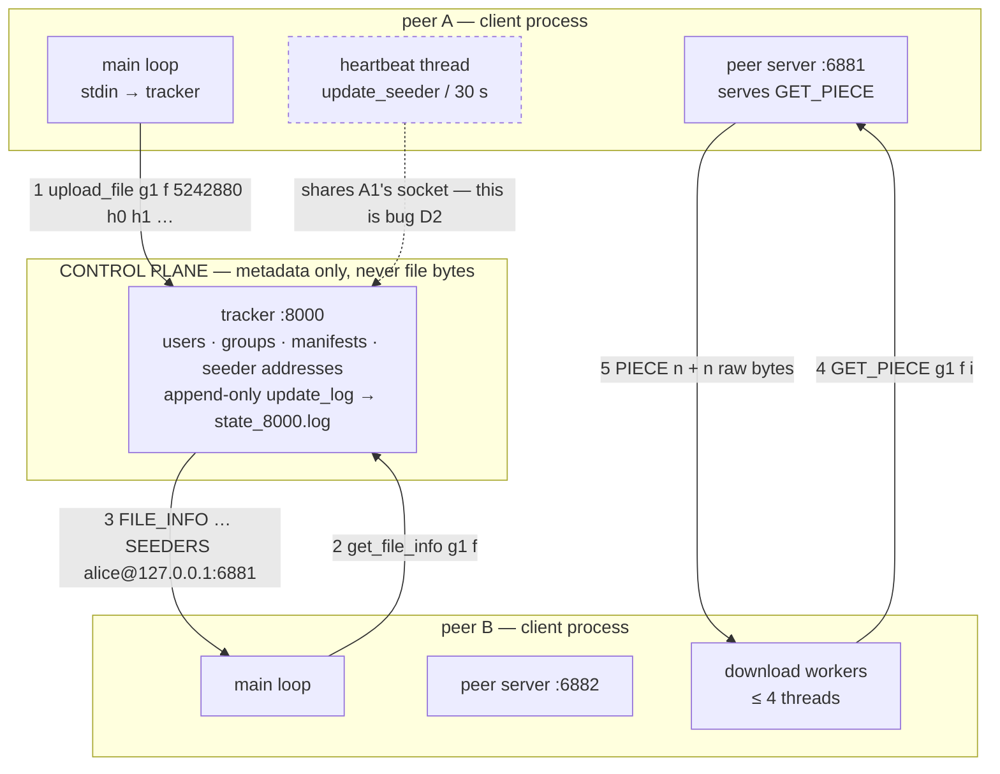

# Architecture — chord-dht-filesystem

The current design, and the log of every decision that produced it. This file is the source the
README's **Key Design Rationales** section is written from, and the source `DEFENCE.md` draws
its questions from.

> **State as of 23 Aug 2026.** What is documented below is the **legacy tracker-and-peers
> system** that exists today, because that is what the code actually does and a diagram of
> something unbuilt is not architecture. The **target** Chord architecture is drawn in Phase 1,
> **after** the five open forks are resolved and the Chord paper is read. Drawing it earlier
> would decide those forks by implication, which is exactly what R11 forbids.

---

## What this system does

A peer-to-peer file-sharing system. Files never live on a central server: each participant
stores files on its own disk and serves them directly to other participants. A **tracker**
process holds only metadata — which files exist, how they are split, the SHA-1 (Secure Hash
Algorithm 1) fingerprint of each piece, and which peers currently claim to hold them. To fetch
a file a peer asks the tracker who has it, then connects to those peers directly and pulls
different pieces from several of them in parallel, verifying each piece against its fingerprint
before writing it to disk.

**Where it is going:** the tracker's role as the single index is replaced by a **Chord
distributed hash table (DHT)** — a ring of nodes that between them own the whole key space, so
that finding which node holds a chunk is a routing problem solved in O(log N) hops rather than
a lookup in one process's memory. The tracker survives in reduced form as a control plane, to
be replicated with **Raft** in Phase 2.

**Scope boundary — what it deliberately does not do:**

- **No storage engine.** Chunks are files on disk. No log-structured merge tree, no compaction,
  no write-ahead log. The interesting problems here are routing, replication and failure
  detection, and adding a storage engine would dilute all three.
- **No NAT traversal, no wide-area deployment.** Every peer is directly addressable. Hole
  punching and relays are a different project.
- **No encryption or authentication on the wire.** Stated as a limitation, not hidden. See
  `DEFENCE.md` — "what would you have to add to run this on the open internet?" is a question
  with a real answer, and it is a better answer than a half-built TLS integration.
- **No incentive mechanism.** BitTorrent's tit-for-tat choking algorithm is deliberately out of
  scope; peers are assumed cooperative.
- **Users, groups and authentication are being removed** (see D-004). They were a coursework
  requirement, not a distributed-systems one.

Non-goals matter. "Why didn't you build X?" is answered much better by a stated scope boundary
than by an apology.

---

## The diagram — the system as it exists today

Kept as diagram-as-text so it diffs in review and cannot silently drift from the design.

**Reading the request path:**

1. Peer A hashes its file in 512 KB pieces and sends the **manifest** — filename, total size,
   and one SHA-1 per piece — to the tracker. The file bytes do not move.
2. Peer B asks the tracker for that manifest.
3. The tracker replies with the piece hashes and the list of seeders, each as
   `username@ip:port`.
4. B's download workers connect **directly to A's peer server** and request pieces by index.
   Up to four workers run, pulling different indices concurrently.
5. A replies with a length-prefixed header and then the raw bytes. B verifies the SHA-1 before
   writing, and re-requests from a different seeder on mismatch.

The dashed edge is not part of the design — it is defect **D2** in `PROGRESS.md`, drawn in
because it is currently real.

---

## Components

| Component | Responsibility | Owns | Talks to |
|---|---|---|---|
| `tracker` | Metadata index and peer discovery. Never touches file bytes. | `users`, `online_users`, `groups`, `group_files` (manifests + seeder sets), `user_address_map`, the append-only `update_log` persisted to `state_<port>.log` | clients (one detached thread each) |
| `client` — main loop | Reads stdin, sends commands, prints replies | `logged_in_user`, `current_sock` | tracker |
| `client` — peer server | Serves `GET_PIECE` to any peer that connects | nothing; reads from disk per request | other clients |
| `client` — download workers | Pull pieces in parallel, verify SHA-1, write at the right offset | one `DownloadTask` | other clients' peer servers |
| `client` — heartbeat thread | Re-announces seeded files every 30 s | `seeding_files` | tracker (**via the main loop's socket — defect D2**) |
| `sha1.h` | Header-only wrapper over OpenSSL `SHA1()`, hex-encoding the 20-byte digest | nothing | — |

---

## Open forks

**Nothing here is implemented until it is decided (R11).** Each fork moves to the decision log
below once resolved. All five are held open until the Chord paper has been read — a fork
decided before the paper is one that cannot be defended in December.

| # | Fork | Why it changes things downstream | Status |
|---|---|---|---|
| **F1** | **Iterative or recursive lookup?** Iterative: I ask a peer, it replies "closer node is N3", I ask N3 myself. Recursive: I ask a peer and it forwards on my behalf, the answer comes back down the chain. | Iterative makes hop counting trivial and failures easy to attribute, at one round trip per hop. Recursive is lower latency but timeouts and partial failures get much harder — **and it costs the easy hop measurement the headline benchmark depends on.** | OPEN — decide end of W1 |
| **F2** | **Does the tracker know where chunks are, or only what chunks exist?** | Manifest-only keeps the ring the single source of truth and the Raft log small. Tracker-holds-placement means one lookup instead of O(log N) hops — but creates **two systems that can now disagree** about where a chunk lives. | OPEN — decide end of W1 |
| **F3** | **Replication — the consistency/availability knob.** Synchronous write to all three successors; or write-one-and-propagate; or quorum with W=2, R=2. | Sync-to-all: any replica is correct, writes as slow as the slowest successor (consistent + partition-tolerant). Write-one: fast writes, stale reads, **needs read repair**. Quorum: more to implement, much more to talk about. **This is the most consequential decision in the design and the one the project round will land on.** | OPEN — decide end of W1 |
| **F4** | **Who decides a peer is dead, and how long does it take?** Stabilisation period alone, or active heartbeats between successors. | Stabilisation alone is simplest and detection time is bounded by the period. Heartbeats detect faster but add background traffic and **force handling of a peer that is slow rather than dead** — which is the hard case. | OPEN — decide end of W1 |
| **F5** | **Chunk size — what is a chunk, and why that number?** | Small chunks parallelise better and recover more cheaply but multiply lookups and metadata; large chunks mean fewer lookups but one slow peer dominates the transfer. **Pick a number now, then measure throughput at three sizes and let the plot justify it.** "512 KB because the assignment said so" and "64 KB because BitTorrent uses it" are both weak answers; a curve is a strong one. | OPEN — number by end of W1, curve in W5 |

---

## Decision log

The heart of this file. One entry per resolved fork. Every entry names the rejected alternative
and its cost — an entry without one is not finished, because "what else did you consider?" is
the follow-up to every design answer.

### D-001 — Repository named `chord-dht-filesystem`
**Date:** 23 Aug 2026 · **Phase:** 0 · **Commit:** pending rename

**The fork:** the repository was called `os-assignment3`, which on a resume reads as coursework
and invites "so this was a class project?" as the opening question of the round.

**Options considered:**

| Option | What it means in practice | Cost |
|---|---|---|
| `chord-dht-filesystem` | Names the algorithm up front | Invites "why Chord and not Kademlia?" — but that is a prepared question, so the cost is negative |
| `distributed-p2p-filestore` | Names the domain, not the algorithm | Safer if the design drifts from strict Chord, but does not signal that a *named protocol* was implemented |
| `chord-raft-filesystem` | Names both planes | Strongest signal — but **promises Raft, which is item 1 in the cut order.** If Raft is cut the name writes a cheque the repository does not cash |
| `ringfs` | Short, product-like | Loses the free keyword match on "Chord" and "DHT" |

**Chosen:** `chord-dht-filesystem`

**Reasoning:** it states the scope in three words and commits only to what the MVP guarantees
by 28 Sep. The Kademlia comparison it invites is one to *want* — it is a question with a
prepared answer about XOR metric versus successor-ring topology.

**Rejected because:** `chord-raft-filesystem` names a component that the pre-agreed cut order
sacrifices first. A repository name is not the place to promise the most cuttable feature.

**What would change my mind:** if Raft ships and is solid by mid-October, renaming is one
command and the history survives.

**Evidence:** none — naming, decided on reasoning.
**Defence entry:** `DEFENCE.md` D-001

---

### D-002 — Phase 0 is a minimum viable resurrection, not a full repair
**Date:** 23 Aug 2026 · **Phase:** 0 · **Commit:** `e5a52fb`

**The fork:** the inherited system has at least fifteen identified defects (`PROGRESS.md`
§ Audit). How many get fixed before Chord work starts?

**Options considered:**

| Option | What it means in practice | Cost |
|---|---|---|
| Minimum viable resurrection | Fix the build (B1, B2), fix state replay (R1), fix the download path (R2). Stop when one file transfers end-to-end and verifies. | ~6–8 h. Leaves D1–D8 open — but most are in code the Chord rewrite deletes anyway |
| Full repair | Also restore multi-tracker sync, fix the desync properly, close the traversal hole, make downloads non-blocking | ~14–16 h. **Eats W1 and most of W2 and pushes Chord routing past the point where W5 is reachable** |
| Build-only, then straight to Chord | Fix compilation, write the postmortem, move on | ~2–3 h. But with no working download there is **no baseline throughput number**, and R13 says a before number is not optional |

**Chosen:** minimum viable resurrection.

**Reasoning:** the point of Phase 0 is not a good legacy system — it is (a) a debugging story
that actually happened and (b) a **before** number that every later benchmark is measured
against. Both need the download path working. Neither needs multi-tracker sync.

**Rejected because:** full repair spends 8 extra hours hardening code that Phase 5 rewrites.
Build-only saves 4 hours and forfeits the baseline, which is the more expensive loss.

**What would change my mind:** if isolating R2 turns out to need the desync fixed first, D2
gets promoted into Phase 0 and the extra hours come out of the 13 h of Phase 1 slack.

**Evidence:** `BENCHMARKS.md` §1 — pending, that is the deliverable of this decision.
**Defence entry:** `DEFENCE.md` D-002

---

### D-003 — The uncommitted November tree is committed as-is, then fixed forward
**Date:** 23 Aug 2026 · **Phase:** 0 · **Commit:** `7f724c8`

**The fork:** 2,247 uncommitted lines sat in the working tree. They fixed two compile errors
(B3, B4) **and regressed three features** that existed at HEAD — `stop_share`, `update_seeder`
and `peer_reconnect_thread`.

**Options considered:**

| Option | What it means in practice | Cost |
|---|---|---|
| Commit as-is first | One honest `wip:` commit naming both what it fixed and what it regressed, then fix forward | An ugly commit sits in the history permanently |
| Reconstruct, then commit clean | Restore the three deleted functions from HEAD first, so one tidy commit lands | Reads better as a diff, but it is **a story about November written in August**, and it hides that the regression happened |
| Discard, start from HEAD | — | Not viable: HEAD does not compile at all, and it throws away real work |

**Chosen:** commit as-is, tagged `pre-resurrection`.

**Reasoning:** history is evidence (R18). An ugly-but-true commit is worth more than a tidy
invented one, and the regression is itself part of the debugging story — "I found my own
working tree had silently dropped three handlers" is a real answer about why uncommitted work
is a liability.

**Rejected because:** reconstructing would have made the diff look deliberate when it was not.
Under questioning that is a story that has to be maintained.

**What would change my mind:** nothing. This is settled.

**Evidence:** none — process decision.
**Defence entry:** `DEFENCE.md` D-003

---

### D-004 — Users, groups and authentication are dropped
**Date:** 23 Aug 2026 · **Phase:** 0 · **Commit:** pending — **after** the baseline is measured

**The fork:** the inherited system has user accounts, passwords, groups with owners, join
requests and an approval workflow. Does that survive the pivot to Chord?

**Options considered:**

| Option | What it means in practice | Cost |
|---|---|---|
| Drop groups and auth | The ring stores content-addressed chunks; the tracker owns the manifest | Deletes working code — but it stays in git history, so nothing is actually lost |
| Keep both, Chord underneath | Preserves working code, the pivot looks continuous | **Every** new subsystem — replication, stabilisation, read repair, anti-entropy — must respect group membership. Four subsystems taxed by a concern no interviewer credits |
| Keep auth, drop groups | Auth is cheap and answers "how do you stop anyone joining the ring?" | One extra concept to defend that the Chord literature has no opinion about |

**Chosen:** drop both.

**Reasoning:** they were a coursework requirement, not a distributed-systems one. Removing them
makes every paper and interview question about DHTs map straight onto the code, and shrinks the
surface that has to be defended for an hour.

**Rejected because:** keeping them costs hours in four separate subsystems for a feature that
earns no credit in a systems round.

**⚠ Sequencing constraint:** **this removal happens after the Phase 0 baseline is recorded, not
before.** The download path runs through `upload_file`, which checks group membership; deleting
that code first would destroy the "before" number that D-002 exists to produce.

**What would change my mind:** if an interviewer's stated focus were access control rather than
distributed systems — which, given the target companies, it is not.

**Evidence:** none — scoping decision.
**Defence entry:** `DEFENCE.md` D-004

---

## Invariants

Things that must always hold. Each is a candidate for a test, and each is something an
interviewer can probe. **Marked ✗ where the current code violates them** — those are the
Phase 0 work list.

| # | Invariant | Enforced by | Tested by | Holds? |
|---|---|---|---|---|
| I1 | A piece written to disk has a SHA-1 matching its manifest entry | check before `write_piece` in `download_piece_from_peer` | not yet | ✓ |
| I2 | **A failed download leaves no file behind** | nothing — `ftruncate` preallocates and nothing cleans up | not yet | **✗ R2** |
| I3 | **Tracker state after restart equals state before restart** | replay of `update_log` in `main` | not yet — `scripts/test-persistence.sh` in Phase 0 | **✗ R1** |
| I4 | A peer only ever serves bytes from files it has explicitly shared | nothing — `GET_PIECE` opens any path given | not yet | **✗ D3** |
| I5 | Malformed input from any peer cannot terminate a process | nothing — bare `stoull` throws in a detached thread | not yet | **✗ D4** |
| I6 | Every reply read by the client's main loop is the reply to the request it just sent | nothing — the heartbeat shares the socket | not yet | **✗ D2** |

---

## Concurrency model

Asked about in nearly every systems interview, and the place where honest projects come apart
under questioning.

### Tracker

| Shared state | Protected by | Held for how long | Why this and not something finer/coarser |
|---|---|---|---|
| `users`, `online_users`, `groups`, `group_files`, `user_address_map` | `state_mtx` — one global mutex | the **entire** `handle_command` body | Coarse and honest. Every command is short and in-memory, so contention is low and correctness is obvious. A per-group or per-map lock would be faster and would need a stated lock order to stay deadlock-free — **not worth it until a benchmark says so**, which is the answer to "why not finer-grained locking?" |
| `update_log`, `next_seq`, the state file | `log_mtx` | one append | Separate from `state_mtx` so the disk write is not inside the state lock |
| `peer_sockets`, `peer_last_seq` | `peer_mtx` | one broadcast loop | Currently vestigial — the peer list is always empty (defect C1) |

**Lock ordering:** `state_mtx` → `log_mtx` → `peer_mtx`, and never the reverse.
`handle_command` takes `state_mtx` and calls `append_update_to_file`, which takes `log_mtx`.
`broadcast_sync` takes `log_mtx` then `peer_mtx`, and is called **after** `handle_command` has
returned and released `state_mtx`. Because every path acquires them in the same order, no cycle
exists and deadlock is impossible. **This is the property to state out loud when asked "how do
you know it can't deadlock?"** — the answer is a total order on locks, not "I tested it".

**Threads in the system:** tracker — one `accept` loop, plus one **detached** thread per
connected client, created at `tracker.cpp:466`. Client — the main stdin loop, one detached
peer-server `accept` loop, one detached thread per inbound peer connection, up to four
download workers (**joined**, not detached), and one detached heartbeat thread.

**Detached versus joined, and why it matters here:** a detached thread cannot be waited on and
cleans up its own resources when it returns. That is fine for a connection handler whose
lifetime is the connection. It is *not* fine at shutdown: nothing joins those threads, so the
tracker has no clean shutdown path at all — it is killed, mid-write if necessary. Worth naming
as a known limitation before someone finds it.

---

## Failure model

| Failure | Detected how | Detection time | Recovery | Measured in |
|---|---|---|---|---|
| Seeder dies mid-transfer | `recv` returns ≤ 0 in the piece loop | immediate | worker tries the next seeder for that piece | not yet |
| Seeder goes offline quietly | 30 s heartbeat stops | **never — the tracker does not expire stale seeders** | none; the peer stays in the seeder list forever | not yet |
| Tracker dies | client `send`/`recv` fails | immediate | client retries 3× then tries other trackers — **of which there are none (C1)**, so it exits | not yet |
| Piece arrives corrupted | SHA-1 mismatch before write | immediate | re-request from another peer | not yet |
| Tracker restarts | — | — | **replay is broken (R1); all groups and manifests are lost** | not yet |

**What this system does not survive:** tracker loss (it is a single point of failure — that is
precisely what Phase 2's Raft group is for); a seeder that is alive but stalled, since there
are no timeouts anywhere on the peer path, only connection failures; and its own restart.

---

## Where it sits on the consistency/availability trade-off

**Currently: neither, honestly.** There is one tracker, so there is nothing to be consistent
*between*; and it is a single point of failure, so it is not available under its own failure
either. A single-node system does not have a CAP (Consistency, Availability, Partition
tolerance) position — CAP only says something once there is more than one replica and a
partition is possible.

Saying that plainly is a stronger answer than claiming a position the architecture does not
earn. **The real answer comes from F3**, which is where this system actually chooses, and it is
written here the moment F3 resolves.

**To flip it:** — pending F3.
