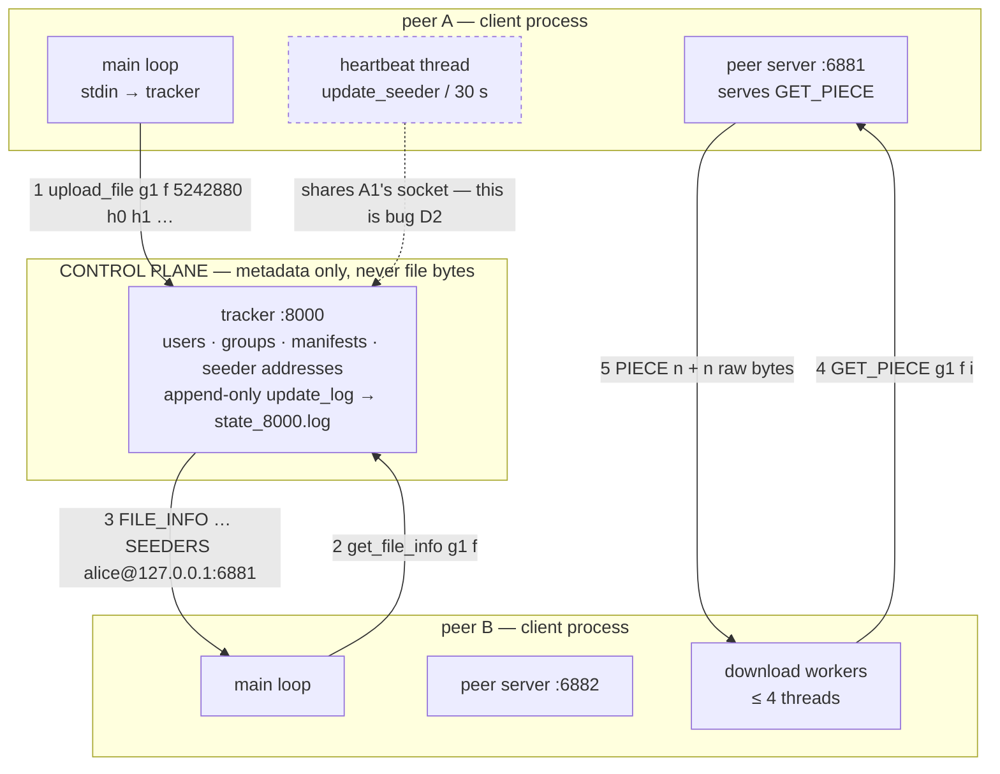
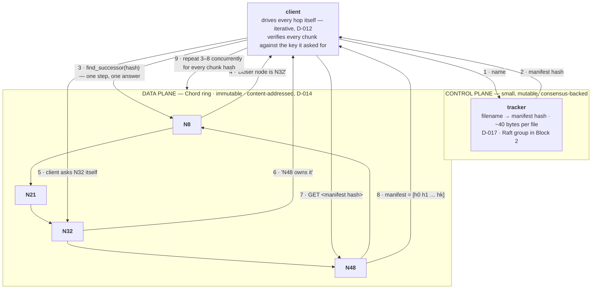

# Architecture — chord-dht-filesystem

The current design, and the log of every decision that produced it. This file is the source the
README's **Key Design Rationales** section is written from, and the source `DEFENCE.md` draws
its questions from.

> **State as of 23 Aug 2026.** What is documented below is the **legacy tracker-and-peers
> system** that exists today, because that is what the code actually does and a diagram of
> something unbuilt is not architecture. The **target** Chord architecture is drawn in Phase 1,
> **after** the five open forks are resolved and the Chord paper is read. Drawing it earlier
> would decide those forks by implication, which is exactly what R11 forbids.

---

## What this system does

A peer-to-peer file-sharing system. Files never live on a central server: each participant
stores files on its own disk and serves them directly to other participants. A **tracker**
process holds only metadata — which files exist, how they are split, the SHA-1 (Secure Hash
Algorithm 1) fingerprint of each piece, and which peers currently claim to hold them. To fetch
a file a peer asks the tracker who has it, then connects to those peers directly and pulls
different pieces from several of them in parallel, verifying each piece against its fingerprint
before writing it to disk.

**Where it is going:** the tracker's role as the single index is replaced by a **Chord
distributed hash table (DHT)** — a ring of nodes that between them own the whole key space, so
that finding which node holds a chunk is a routing problem solved in O(log N) hops rather than
a lookup in one process's memory. The tracker survives in reduced form as a control plane, to
be replicated with **Raft** in Block 2.

**Scope boundary — what it deliberately does not do:**

- **No storage engine.** Chunks are files on disk. No log-structured merge tree, no compaction,
  no write-ahead log. The interesting problems here are routing, replication and failure
  detection, and adding a storage engine would dilute all three.
- **No NAT traversal, no wide-area deployment.** Every peer is directly addressable. Hole
  punching and relays are a different project.
- **No encryption or authentication on the wire.** Stated as a limitation, not hidden. See
  `DEFENCE.md` — "what would you have to add to run this on the open internet?" is a question
  with a real answer, and it is a better answer than a half-built TLS integration.
- **No incentive mechanism.** BitTorrent's tit-for-tat choking algorithm is deliberately out of
  scope; peers are assumed cooperative.
- **Users, groups and authentication are being removed** (see D-004). They were a coursework
  requirement, not a distributed-systems one.

Non-goals matter. "Why didn't you build X?" is answered much better by a stated scope boundary
than by an apology.

---

## The diagram — the system as it exists today

Kept as diagram-as-text so it diffs in review and cannot silently drift from the design.



**Reading the request path:**

1. Peer A hashes its file in 512 KB pieces and sends the **manifest** — filename, total size,
   and one SHA-1 per piece — to the tracker. The file bytes do not move.
2. Peer B asks the tracker for that manifest.
3. The tracker replies with the piece hashes and the list of seeders, each as
   `username@ip:port`.
4. B's download workers connect **directly to A's peer server** and request pieces by index.
   Up to four workers run, pulling different indices concurrently.
5. A replies with a length-prefixed header and then the raw bytes. B verifies the SHA-1 before
   writing, and re-requests from a different seeder on mismatch.

The dashed edge is not part of the design — it is defect **D2** in `PROGRESS.md`, drawn in
because it is currently real.

---

---

## The target diagram — the system the five forks describe

Drawn **after** the forks were resolved, per R11: a diagram made earlier would have decided them
by implication. Kept as diagram-as-text so it diffs in review and cannot drift from the design.



The arrows inside the ring are **successor pointers**. They are the only routing state that has
to be correct; everything else is an accelerator.

**Reading the path.** Steps 1–2 are the only time the tracker is involved, and it returns 40
bytes. Steps 3–6 are the iterative lookup: each node answers *one* question and returns
immediately, and the **client** opens the next connection — which is what makes hop count a
number the client observes rather than one the ring reports. Steps 7–8 fetch the manifest, which
is itself just a chunk. Step 9 repeats the whole lookup-and-fetch for every chunk hash, issued
**concurrently**, because content addressing means consecutive chunks of one file live on
unrelated nodes and there is no locality to walk.

**What each node holds**, in strict order of how much it matters:

| Structure | Carries | If stale or wrong |
|---|---|---|
| **successor pointer** | correctness | wrong answers, returned confidently, undetectable |
| **successor list** (`r ≈ log₂N`) | survival of failure — **and it is the replica set** | node orphaned only if *all* `r` die within one period |
| **finger table** (`m` rows, ~`log₂N` distinct) | speed only | more hops, never a wrong answer |
| **predecessor** | knowing its own arc; joins | joins stall until repaired |
| **chunk store** | the data, keyed by `SHA-1` of its own contents | a failed hash check at the reader; try the next replica |

**What runs in the background on every node**, forever: `stabilize` every `T` seconds (asks the
successor for its predecessor, tightens the pointer, `notify`s), `fix_fingers` (refreshes one
finger per round), and `check_predecessor`. Failure detection rides on these plus **any** failed
call to the successor from any code path (D-013). Nothing is event-driven; everything is
re-derived, so the ring converges from any state.

**What this diagram deliberately does not show**, because they do not exist yet: the Raft group
behind the tracker (Block 2, subject to the 1 Nov trip-wire) and virtual nodes (Phase 4).

## Components

| Component | Responsibility | Owns | Talks to |
|---|---|---|---|
| `tracker` | Metadata index and peer discovery. Never touches file bytes. | `users`, `online_users`, `groups`, `group_files` (manifests + seeder sets), `user_address_map`, the append-only `update_log` persisted to `state_<port>.log` | clients (one detached thread each) |
| `client` — main loop | Reads stdin, sends commands, prints replies | `logged_in_user`, `current_sock` | tracker |
| `client` — peer server | Serves `GET_PIECE` to any peer that connects | nothing; reads from disk per request | other clients |
| `client` — download workers | Pull pieces in parallel, verify SHA-1, write at the right offset | one `DownloadTask` | other clients' peer servers |
| `client` — heartbeat thread | Re-announces seeded files every 30 s | `seeding_files` | tracker (**via the main loop's socket — defect D2**) |
| `sha1.h` | Header-only wrapper over OpenSSL `SHA1()`, hex-encoding the 20-byte digest | nothing | — |

---

## Open forks

**Nothing here is implemented until it is decided (R11).** Each fork moves to the decision log
below once resolved. All five are held open until the Chord paper has been read — a fork
decided before the paper is one that cannot be defended in December.

| # | Fork | Why it changes things downstream | Status |
|---|---|---|---|
| **F1** | **Iterative or recursive lookup?** Iterative: I ask a peer, it replies "closer node is N3", I ask N3 myself. Recursive: I ask a peer and it forwards on my behalf, the answer comes back down the chain. | Iterative makes hop counting trivial and failures easy to attribute, at one round trip per hop. Recursive is lower latency but timeouts and partial failures get much harder — **and it costs the easy hop measurement the headline benchmark depends on.** | **RESOLVED** — D-012 |
| **F2** | **Does the tracker know where chunks are, or only what chunks exist?** | Manifest-only keeps the ring the single source of truth and the Raft log small. Tracker-holds-placement means one lookup instead of O(log N) hops — but creates **two systems that can now disagree** about where a chunk lives. | **RESOLVED** — D-017 |
| **F3** | **Replication — the consistency/availability knob.** Synchronous write to all three successors; or write-one-and-propagate; or quorum with W=2, R=2. | Sync-to-all: any replica is correct, writes as slow as the slowest successor (consistent + partition-tolerant). Write-one: fast writes, stale reads, **needs read repair**. Quorum: more to implement, much more to talk about. **This is the most consequential decision in the design and the one the project round will land on.** | **RESOLVED** — D-014, D-015 |
| **F4** | **Who decides a peer is dead, and how long does it take?** Stabilisation period alone, or active heartbeats between successors. | Stabilisation alone is simplest and detection time is bounded by the period. Heartbeats detect faster but add background traffic and **force handling of a peer that is slow rather than dead** — which is the hard case. | **RESOLVED** — D-013 |
| **F5** | **Chunk size — what is a chunk, and why that number?** | Small chunks parallelise better and recover more cheaply but multiply lookups and metadata; large chunks mean fewer lookups but one slow peer dominates the transfer. **Pick a number now, then measure throughput at three sizes and let the plot justify it.** "512 KB because the assignment said so" and "64 KB because BitTorrent uses it" are both weak answers; a curve is a strong one. | **RESOLVED** — D-016 |

| **F6** | **The `update_seeder` desync — what should a peer do after it finishes downloading?** The client announces "I can seed this now" and never reads the reply; the tracker does not implement the command. Every reply after the first download is one behind. | This is not a typo, it is a missing piece of the protocol. Whatever is chosen sets the rule for **every** fire-and-forget message in the system — and the same shape recurs in D2's heartbeat. Deciding it once, deliberately, settles both. | **RESOLVED** — D-007 |
| **F6a** | **The heartbeat thread sends on the main loop's socket and ignores the reply**, so fixing F6 alone would re-create the desync every 30 seconds. | Sub-fork surfaced mid-implementation of F6 and stopped for (R6). | **RESOLVED** — D-008 |
| **F8** | **How does the tracker recover its state?** Replay re-ran every logged command through the live handler, which rejected all of them (defect R1). Options: a replay flag that makes the guards skip themselves; splitting admission from effect so recovery cannot reach a guard; or logging the effect rather than the request (event sourcing). | Sets whether the *class* of bug is avoided by remembering something or made impossible by structure — and the same question returns in Block 2, where Raft replicates log entries that other nodes must apply with no client attached. | **RESOLVED** — D-009 |
| **F9** | **How many lines is a reply?** Five tracker replies contain an embedded newline, so one command produces two lines and every later reply on that connection is one behind (defect R6). Options: fix the five strings; make the framing layer enforce the invariant; or length-prefix replies so the delimiter stops mattering. | Settles whether the rule lives in the framing layer or in every author's memory — and the same question returns on every new control message Chord adds. | **RESOLVED** — D-010 |
| **F10** | **What happens when the peer is gone?** Neither binary ignored `SIGPIPE`, so a `send` to a departed peer killed the process outright (defect R9). Options: ignore the signal process-wide; pass `MSG_NOSIGNAL` at every call site; or both. | Decides whether a remote party's ordinary behaviour can end this program — and the same question returns for every socket Chord adds. | **RESOLVED** — D-011 |
| **F7** | **What is on disk after a failed transfer?** Today: a full-size, zero-filled file, indistinguishable from a real one by size. | Sets whether the system is safe to use without reading its output carefully, and whether resumable downloads are possible later. Atomic rename is the standard answer and costs a story about the leftover `.part` file. | OPEN — decide before Phase 5 |
| **F11** | **Is a ring member its own process, or is a participant one process?** A standalone `node` daemon with `client` as the originator outside the ring, or the existing `client` peer-server thread grown into the ring node. | Sets per-node resident set size, and therefore the **maximum ring size** that fits in 3.4 GiB — which is the x-axis of the Phase 2 hop-count plot. Also decides whether Phase 2 edits a working 1013-line transfer path. | **RESOLVED** — D-018 |
| **F12** | **How wide is the identifier space?** Full 160-bit SHA-1 with hand-written modular arithmetic, a 64-bit truncation using the machine word's own wrap-around, or 128 bits via a compiler extension. | Sets every data structure and every line of arithmetic in Phase 2 — and decides whether the code underneath the hop-count measurement is hand-written or free. | **RESOLVED** — D-019 |
| **F14** | **The node's wire protocol.** Where the framing code comes from, what a lookup carries, and whether a node may claim ownership from its predecessor. | Decides whether invariant-enforcing code exists once or three times, whether Phase 3 needs a second message type, and whether a second pointer becomes correctness-critical. | **RESOLVED** — D-021 |
| **F17** | **What is this system, in one line?** Phase 1's decisions turned a BitTorrent-style swarm into distributed storage. Options: say so; make "peer-to-peer" true again; or keep the wording and defend it in Chord's sense. | Decides whether the first word of the resume survives questioning, and exposed a real alternative never weighed in Phase 1: trackerless BitTorrent. | **RESOLVED** — D-022 |
| **F18** | **Is deletion in scope, and when?** Unnaming a file, reclaiming unreferenced chunks, both, or neither. | Deduplication means deleting a file's chunks can destroy another file, and with no access control a delete command is a vandalism tool — so the obvious implementation is wrong twice. | **RESOLVED** — D-023: not in the MVP; owner-token unnaming plus a mark-and-sweep collector in Block 2, cut before Raft |
| **F15** | **How is a node-identifier collision detected and recovered from?** Detect at join by asking `find_successor(my_id)` and comparing addresses, then re-hash with a salt; or detect at ring construction only; or rely on the birthday bound alone, as the Chord paper does. | Surfaced while resolving F12 and deliberately **not** settled by implication (R6). Salting trades away part of the property that an identifier is verifiable from an address, which touches the Sybil/eclipse answer already marked `WEAK`. | OPEN — decide in Phase 3, with the join path |
| **F13** | **What does a node know when it starts, on a fixed ring with no joins?** Full membership as a construction input; successor only, with tables built by real lookups; or the harness computing every table offline. | Decides whether the hop-count plot measures routing alone or routing tangled with bootstrap — and whether total routing state is O(N log N) or O(N²), which bounds the ring size the plot can reach. | **RESOLVED** — D-020 |
| **F16** | **How far does the hop-count curve go?** Real processes only, capped by RAM; or real processes extended by an in-process simulation over the same pure functions, plotted together so they can be shown to agree where they overlap. | Hop count is a deterministic function of the routing tables, so a simulation can reach N = 10⁶. Logged rather than decided by implication (R6). | OPEN — decide in step 2.5, with the benchmark |

---

## Decision log

The heart of this file. One entry per resolved fork. Every entry names the rejected alternative
and its cost — an entry without one is not finished, because "what else did you consider?" is
the follow-up to every design answer.

### D-001 — Repository named `chord-dht-filesystem`
**Date:** 23 Aug 2026 · **Phase:** 0 · **Commit:** pending rename

**The fork:** the repository was called `os-assignment3`, which on a resume reads as coursework
and invites "so this was a class project?" as the opening question of the round.

**Options considered:**

| Option | What it means in practice | Cost |
|---|---|---|
| `chord-dht-filesystem` | Names the algorithm up front | Invites "why Chord and not Kademlia?" — but that is a prepared question, so the cost is negative |
| `distributed-p2p-filestore` | Names the domain, not the algorithm | Safer if the design drifts from strict Chord, but does not signal that a *named protocol* was implemented |
| `chord-raft-filesystem` | Names both planes | Strongest signal — but **promises Raft, which is item 1 in the cut order.** If Raft is cut the name writes a cheque the repository does not cash |
| `ringfs` | Short, product-like | Loses the free keyword match on "Chord" and "DHT" |

**Chosen:** `chord-dht-filesystem`

**Reasoning:** it states the scope in three words and commits only to what the MVP guarantees
by 28 Sep. The Kademlia comparison it invites is one to *want* — it is a question with a
prepared answer about XOR metric versus successor-ring topology.

**Rejected because:** `chord-raft-filesystem` names a component that the pre-agreed cut order
sacrifices first. A repository name is not the place to promise the most cuttable feature.

**What would change my mind:** if Raft ships and is solid by mid-October, renaming is one
command and the history survives.

**Evidence:** none — naming, decided on reasoning.
**Defence entry:** `DEFENCE.md` D-001

---

### D-002 — Phase 0 is a minimum viable resurrection, not a full repair
**Date:** 23 Aug 2026 · **Phase:** 0 · **Commit:** `e5a52fb`

**The fork:** the inherited system has at least fifteen identified defects (`PROGRESS.md`
§ Audit). How many get fixed before Chord work starts?

**Options considered:**

| Option | What it means in practice | Cost |
|---|---|---|
| Minimum viable resurrection | Fix the build (B1, B2), fix state replay (R1), fix the download path (R2). Stop when one file transfers end-to-end and verifies. | ~6–8 h. Leaves D1–D8 open — but most are in code the Chord rewrite deletes anyway |
| Full repair | Also restore multi-tracker sync, fix the desync properly, close the traversal hole, make downloads non-blocking | ~14–16 h. **Eats W1 and most of W2 and pushes Chord routing past the point where W5 is reachable** |
| Build-only, then straight to Chord | Fix compilation, write the postmortem, move on | ~2–3 h. But with no working download there is **no baseline throughput number**, and R13 says a before number is not optional |

**Chosen:** minimum viable resurrection.

**Reasoning:** the point of Phase 0 is not a good legacy system — it is (a) a debugging story
that actually happened and (b) a **before** number that every later benchmark is measured
against. Both need the download path working. Neither needs multi-tracker sync.

**Rejected because:** full repair spends 8 extra hours hardening code that Phase 5 rewrites.
Build-only saves 4 hours and forfeits the baseline, which is the more expensive loss.

**What would change my mind:** if isolating R2 turns out to need the desync fixed first, D2
gets promoted into Phase 0 and the extra hours come out of the 13 h of Block 1 slack.

**Evidence:** `BENCHMARKS.md` §1 — pending, that is the deliverable of this decision.
**Defence entry:** `DEFENCE.md` D-002

---

### D-003 — The uncommitted November tree is committed as-is, then fixed forward
**Date:** 23 Aug 2026 · **Phase:** 0 · **Commit:** `7f724c8`

**The fork:** 2,247 uncommitted lines sat in the working tree. They fixed two compile errors
(B3, B4) **and regressed three features** that existed at HEAD — `stop_share`, `update_seeder`
and `peer_reconnect_thread`.

**Options considered:**

| Option | What it means in practice | Cost |
|---|---|---|
| Commit as-is first | One honest `wip:` commit naming both what it fixed and what it regressed, then fix forward | An ugly commit sits in the history permanently |
| Reconstruct, then commit clean | Restore the three deleted functions from HEAD first, so one tidy commit lands | Reads better as a diff, but it is **a story about November written in August**, and it hides that the regression happened |
| Discard, start from HEAD | — | Not viable: HEAD does not compile at all, and it throws away real work |

**Chosen:** commit as-is, tagged `pre-resurrection`.

**Reasoning:** history is evidence (R18). An ugly-but-true commit is worth more than a tidy
invented one, and the regression is itself part of the debugging story — "I found my own
working tree had silently dropped three handlers" is a real answer about why uncommitted work
is a liability.

**Rejected because:** reconstructing would have made the diff look deliberate when it was not.
Under questioning that is a story that has to be maintained.

**What would change my mind:** nothing. This is settled.

**Evidence:** none — process decision.
**Defence entry:** `DEFENCE.md` D-003

---

### D-004 — Users, groups and authentication are dropped
**Date:** 23 Aug 2026 · **Phase:** 0 · **Commit:** pending — **after** the baseline is measured

**The fork:** the inherited system has user accounts, passwords, groups with owners, join
requests and an approval workflow. Does that survive the pivot to Chord?

**Options considered:**

| Option | What it means in practice | Cost |
|---|---|---|
| Drop groups and auth | The ring stores content-addressed chunks; the tracker owns the manifest | Deletes working code — but it stays in git history, so nothing is actually lost |
| Keep both, Chord underneath | Preserves working code, the pivot looks continuous | **Every** new subsystem — replication, stabilisation, read repair, anti-entropy — must respect group membership. Four subsystems taxed by a concern no interviewer credits |
| Keep auth, drop groups | Auth is cheap and answers "how do you stop anyone joining the ring?" | One extra concept to defend that the Chord literature has no opinion about |

**Chosen:** drop both.

**Reasoning:** they were a coursework requirement, not a distributed-systems one. Removing them
makes every paper and interview question about DHTs map straight onto the code, and shrinks the
surface that has to be defended for an hour.

**Rejected because:** keeping them costs hours in four separate subsystems for a feature that
earns no credit in a systems round.

**⚠ Sequencing constraint:** **this removal happens after the Phase 0 baseline is recorded, not
before.** The download path runs through `upload_file`, which checks group membership; deleting
that code first would destroy the "before" number that D-002 exists to produce.

**What would change my mind:** if an interviewer's stated focus were access control rather than
distributed systems — which, given the target companies, it is not.

**Evidence:** none — scoping decision.
**Defence entry:** `DEFENCE.md` D-004

---

## Invariants

Things that must always hold. Each is a candidate for a test, and each is something an
interviewer can probe. **Marked ✗ where the current code violates them** — those are the
Phase 0 work list.

| # | Invariant | Enforced by | Tested by | Holds? |
|---|---|---|---|---|
| I1 | A piece written to disk has a SHA-1 matching its manifest entry | check before `write_piece` in `download_piece_from_peer` | not yet | ✓ |
| I2 | **A failed download leaves no file behind** | nothing — `ftruncate` preallocates and nothing cleans up | not yet | **✗ R2** |
| I3 | **Tracker state after restart equals state before restart** | replay of `update_log` in `main` | not yet — `scripts/test-persistence.sh` in Phase 0 | **✗ R1** |
| I4 | A peer only ever serves bytes from files it has explicitly shared | nothing — `GET_PIECE` opens any path given | not yet | **✗ D3** |
| I5 | Malformed input from any peer cannot terminate a process | nothing — bare `stoull` throws in a detached thread | not yet | **✗ D4** |
| I6 | Every reply read by the client's main loop is the reply to the request it just sent | nothing — the heartbeat shares the socket | not yet | **✗ D2** |
| I7 | **A routing identifier decides which *node*; it never decides which *object*.** The chunk store is keyed by the full 160-bit hash | D-019 — truncation is applied to placement only | in-process test, step 2.4 | ✓ by construction (no Chord code yet) |
| I8 | **"Am I alone in the ring?" is answered by comparing *addresses*, never identifiers** — because `(n, n]` evaluates to the whole ring, so `successor.id == my_id` silently means "I own everything" | D-019 — `successor.address == my_address` | in-process test, step 2.4 | ✓ by construction (no Chord code yet) |

---

## Concurrency model

Asked about in nearly every systems interview, and the place where honest projects come apart
under questioning.

### Tracker

| Shared state | Protected by | Held for how long | Why this and not something finer/coarser |
|---|---|---|---|
| `users`, `online_users`, `groups`, `group_files`, `user_address_map` | `state_mtx` — one global mutex | the **entire** `handle_command` body | Coarse and honest. Every command is short and in-memory, so contention is low and correctness is obvious. A per-group or per-map lock would be faster and would need a stated lock order to stay deadlock-free — **not worth it until a benchmark says so**, which is the answer to "why not finer-grained locking?" |
| `update_log`, `next_seq`, the state file | `log_mtx` | one append | Separate from `state_mtx` so the disk write is not inside the state lock |
| `peer_sockets`, `peer_last_seq` | `peer_mtx` | one broadcast loop | Currently vestigial — the peer list is always empty (defect C1) |

**Lock ordering:** `state_mtx` → `log_mtx` → `peer_mtx`, and never the reverse.
`handle_command` takes `state_mtx` and calls `append_update_to_file`, which takes `log_mtx`.
`broadcast_sync` takes `log_mtx` then `peer_mtx`, and is called **after** `handle_command` has
returned and released `state_mtx`. Because every path acquires them in the same order, no cycle
exists and deadlock is impossible. **This is the property to state out loud when asked "how do
you know it can't deadlock?"** — the answer is a total order on locks, not "I tested it".

**Threads in the system:** tracker — one `accept` loop, plus one **detached** thread per
connected client, created at `tracker.cpp:466`. Client — the main stdin loop, one detached
peer-server `accept` loop, one detached thread per inbound peer connection, up to four
download workers (**joined**, not detached), and one detached heartbeat thread.

**Detached versus joined, and why it matters here:** a detached thread cannot be waited on and
cleans up its own resources when it returns. That is fine for a connection handler whose
lifetime is the connection. It is *not* fine at shutdown: nothing joins those threads, so the
tracker has no clean shutdown path at all — it is killed, mid-write if necessary. Worth naming
as a known limitation before someone finds it.

---

## Failure model

| Failure | Detected how | Detection time | Recovery | Measured in |
|---|---|---|---|---|
| Seeder dies mid-transfer | `recv` returns ≤ 0 in the piece loop | immediate | worker tries the next seeder for that piece | not yet |
| Seeder goes offline quietly | 30 s heartbeat stops | **never — the tracker does not expire stale seeders** | none; the peer stays in the seeder list forever | not yet |
| Tracker dies | client `send`/`recv` fails | immediate | client retries 3× then tries other trackers — **of which there are none (C1)**, so it exits | not yet |
| Piece arrives corrupted | SHA-1 mismatch before write | immediate | re-request from another peer | not yet |
| Tracker restarts | — | — | **replay is broken (R1); all groups and manifests are lost** | not yet |

**What this system does not survive:** tracker loss (it is a single point of failure — that is
precisely what Block 2's Raft group is for); a seeder that is alive but stalled, since there
are no timeouts anywhere on the peer path, only connection failures; and its own restart.

---

## Where it sits on the consistency/availability trade-off

**Currently: neither, honestly.** There is one tracker, so there is nothing to be consistent
*between*; and it is a single point of failure, so it is not available under its own failure
either. A single-node system does not have a CAP (Consistency, Availability, Partition
tolerance) position — CAP only says something once there is more than one replica and a
partition is possible.

Saying that plainly is a stronger answer than claiming a position the architecture does not
earn. **The real answer comes from F3**, which is where this system actually chooses, and it is
written here the moment F3 resolves.

**To flip it:** — pending F3.

---

### D-005 — Fix the build with the smallest change that is *true*, not the smallest change that works
**Date:** 1 Sep 2026 · **Phase:** 0 · **Commit:** this session

**The fork:** `client` failed to link with `undefined reference to SHA1`. Where does `-lcrypto` go?

| Option | What it means in practice | Cost |
|---|---|---|
| Add `-lcrypto` to `CXXFLAGS` | One line, works immediately, both binaries get it | Links a cryptography library into `tracker`, which hashes nothing today. Also conflates compile-time flags with link-time libraries, which is how a `Makefile` stops being readable |
| A separate `CRYPTO_LDLIBS`, applied to the `client` rule only | Names the dependency where it is real | Two lines instead of one, and it must be revisited when the tracker starts hashing |
| Move `sha1.h` to a real `sha1.cpp` and build `sha1.o` | Makes the original `Makefile` correct rather than deleting its claim | Solves a problem that does not exist — the header is genuinely header-only, and this adds a translation unit to justify a line that was simply wrong |

**Chosen:** a separate `CRYPTO_LDLIBS` on the `client` rule.

**Reasoning:** the `Makefile` should state what is true. `tracker.cpp` does not include `sha1.h`
and links clean without `-lcrypto` — verified, not assumed. The tracker *will* need SHA-1 in
Phase 2, when node identifiers and keys are hashed onto the ring; the flag gets added to its
rule then, when it is true. A dependency added early "because we'll need it" is a dependency
nobody can later explain.

**Rejected because:** the global-`CXXFLAGS` version is indistinguishable from not having
thought about it, and "why does your tracker link OpenSSL?" is a question with no good answer.

**What would change my mind:** the moment `tracker.cpp` hashes anything, which is Phase 2.

**Evidence:** `docs/failures.md` B1, B2. `make clean && make` builds both binaries with zero warnings.
**Defence entry:** `DEFENCE.md` D-005

---

### D-006 — A failing test is committed on purpose
**Date:** 1 Sep 2026 · **Phase:** 0 · **Commit:** this session

**The fork:** `scripts/e2e-edge.sh` sweeps file sizes across the piece boundary and currently
fails five of seven cases, because it found defects R3 and R4 which are not yet fixed. Does a
failing test get committed?

| Option | What it means in practice | Cost |
|---|---|---|
| Commit it failing, with the expectation documented in the script header | The known defect is pinned by something executable. Anyone who fixes R3 sees the row turn green | A red test in the repository, which looks like carelessness to someone who does not read the header |
| Hold it back until R3 and R4 are fixed | The repository is always green | The defect exists only as prose until then, and prose does not detect a regression |
| Mark the failing cases as skipped | Green, and the cases are still there | A skipped test is a test nobody looks at. The failure *is* the information |

**Chosen:** commit it failing, with the expectation stated in the script header and in
`docs/failures.md`.

**Reasoning:** the sweep is what found R3, and R3 is invisible to any test that transfers one
file. Its value is precisely that it is red. The output is also self-diagnosing — the one-row
shift in the size column names the defect without reading any code.

**Rejected because:** holding it back means the only record of R3 is a paragraph, and a
paragraph cannot tell you when the bug comes back.

**What would change my mind:** if the repository ever gets continuous integration that gates
merges, this moves behind an explicit `expected-failure` marker rather than a plain red.

**Evidence:** `docs/failures.md` R3, R4. `PROGRESS.md` error log E3.
**Defence entry:** `DEFENCE.md` D-006

---

### D-007 — Every request gets exactly one response, and it is read before the next is sent
**Date:** 2 Sep 2026 · **Phase:** 0 · **Fork:** F6

**The fork:** after a download completed the client sent `update_seeder` and never read
the reply. The tracker did not implement the command, answered `Unknown command`, and that
reply sat in the buffer — every later response was one behind, for the life of the connection
(defect R3).

| Option | What it means in practice | Cost |
|---|---|---|
| Implement it and read the reply | Tracker gains a real handler; client consumes the response | One round trip per completed download — **per file, not per piece**, so noise against a transfer that just moved megabytes |
| Delete the send | One line, desync gone | A peer that finishes downloading never announces it can seed. **Every future download still comes from the original uploader and the swarm never grows** — which removes the property that makes peer-to-peer worth building |
| One-way notification, tracker never replies | Fastest, no round trip | The protocol now has two classes of message. Anyone who later adds a reply to that command silently re-breaks every subsequent response |

**Chosen:** implement it and read the reply.

**Reasoning:** it keeps **one universal invariant** — every request is followed by exactly one
response, read before the next request is sent. A rule with no exceptions is one that cannot be
got wrong by the next person to touch the protocol. The measured cost is one round trip per
completed file.

**Rejected because:** deleting the send is cheapest and guts the swarm. The one-way variant is
fastest and buys that speed by introducing a special case, which is exactly the shape of the
bug being fixed.

**What would change my mind:** if announcements ever became high-frequency — per piece rather
than per file — the round trip would start to matter and a batched or one-way channel would
earn its complexity.

**Evidence:** `scripts/e2e-edge.sh` — 6/7 cases pass, up from 1/7; the one-row size shift that
was R3's signature is gone. Seeder set verified to grow: `alice@...:6881` before bob's
download, `bob@...:6882 alice@...:6881` after.
**Defence entry:** `DEFENCE.md` D-007

---

### D-008 — The announcer owns its own connection; sharing is removed rather than guarded
**Date:** 2 Sep 2026 · **Phase:** 0 · **Fork:** F6a

**The fork:** surfaced while implementing D-007 and stopped for, rather than decided in
passing (R6). The heartbeat thread wrote `update_seeder` down the **main loop's** socket and
ignored the reply (defect D2). Fixing F6 without touching it would have re-created the desync
on a 30-second timer.

Two facts found while investigating, both of which changed the options:

- `sock_mtx` was taken in **exactly one place** — the heartbeat's `send`. The main loop's
  send/recv pair took no lock at all. The lock everyone assumed was protecting the socket was
  serialising the heartbeat against nothing.
- There is **no `seeders.erase` anywhere** in the tracker. Nothing ever removes a seeder, so
  re-announcing achieved nothing. A heartbeat with no timeout on the receiving side is not a
  heartbeat; it is traffic.

| Option | What it means in practice | Cost |
|---|---|---|
| Widen `sock_mtx` to span send *and* receive | The lock finally covers the real transaction | The heartbeat briefly blocks the main loop, and one socket is still shared between two threads — the weaker shape |
| Delete the heartbeat until expiry exists | Removes code that has no effect today | Nothing re-populates the seeder set after a tracker restart; the feature returns with F4 |
| **Give the announcer its own connection** | One thread, one conversation, no sharing | An extra connection and socket per client |

**Chosen:** its own connection.

**Reasoning:** the invariant that broke is *send-then-receive as a pair*. **A mutex protects
state; this is a rule about sequence**, and no lock expresses it. Two threads cannot share one
request/response conversation regardless of locking, because thread A can consume thread B's
response. Removing the sharing makes the invariant hold by construction rather than by
discipline.

**Rejected because:** widening the lock makes the bug unreachable while leaving the bad shape
in place, and it is the fix that looks correct in review while still being one careless commit
away from breaking. Deleting the heartbeat is defensible today but throws away the mechanism
F4 needs.

**Implementation notes worth defending:**

- The announcer **reads and discards the tracker's `TRACKERS` greeting** on connect. Leaving it
  would put the new connection one reply behind from its first request — the same bug, on the
  connection built to avoid it.
- It waits on a `condition_variable` with a **predicate over a generation counter**, not a bare
  `wait_for`. A bare wait would (a) miss a notification that arrives before the first wait and
  (b) treat a spurious wake-up as a real change. The counter makes both correct.
- It **copies the seed list under the lock and releases before doing network I/O**. Holding
  `seeding_mtx` across a blocking `send`/`recv` would stall the main loop on every upload.
- `update_seeder` is **not written to the update log**. Which peer currently holds a file is
  **soft state** — true only while that peer is alive. Replaying it at startup would resurrect
  peers that are long gone. Durable state is "this file exists and here is its manifest".

**Known limitation, stated rather than hidden:** the announcer does not reconnect if its
connection drops; the peer then stops being re-advertised. Acceptable while nothing expires
seeders — it becomes real work the moment F4 lands.

**Evidence:** `BENCHMARKS.md` — pending. Verified functionally three consecutive runs.
**Defence entry:** `DEFENCE.md` D-007, D-009

---

### D-009 — Admission and effect are separate; recovery can only reach the effect

**Fork:** F8. **Date:** 6 Sep 2026. **Closes:** defect R1.

**The decision.** Every mutating command is split into an `apply_*` function that performs the
state transition and nothing else, and a set of admission checks that stay on the live path in
`handle_command`. Recovery has its own entry point, `replay_command`, which calls `apply_*`
directly and never calls `handle_command`.

**What the split means in practice.** A check belongs on the live path if it asks about the
*requester* or about *soft state* — "are you who you say you are?", "are you logged in?". A
check belongs in `apply_*` if it asks about *durable state* — "does this group exist?", "is
this user a member?" Those are deterministic: they were true when the command was accepted, so
they are true again when the log is replayed in the same order.

**Why this and not the smaller change.** The obvious repair is a `replaying` flag that makes
the guards skip themselves. It is twenty minutes of work and it leaves the guards in the
recovery path, disabled by a boolean. Every guard added later is a fresh opportunity to forget
the flag, and the failure is silent — which is exactly how R1 survived from November to
September without anyone noticing. Splitting the functions removes the possibility rather than
the symptom: recovery cannot skip a guard it has no code path to.

Two supporting changes turn "avoided" into "impossible":

- `handle_command`'s `bool record = true` parameter was deleted and `client_user` lost its
  default value, so the exact call that caused R1 — `handle_command(cmdline, "", false)` — **no
  longer compiles.**
- `replay_command` is an exhaustive, readable list of the six things recovery may do. Anything
  else is skipped with a message naming it, which also makes the tracker safe against the
  coursework-era log format that recorded reads and logins.

**Rejected: option A, a replay flag.** ~20 minutes instead of ~2 hours. Rejected because the
cost is paid later and silently, and because the guard-skipping flag is itself the bug pattern
that produced R1.

**Rejected: option C, log the effect rather than the request (event sourcing).** The tracker
would record `GROUP_CREATED g1 alice` instead of the client's `create_group g1 alice`, and
recovery would apply effects that have no notion of a requester at all. **This is the better
system and it is worth saying so.** It costs ~3 hours and a new on-disk format, spent on a
control plane that Block 2 replaces with a Raft-replicated tracker — and Raft brings the same
structure back for a stronger reason, because a follower applies log entries with no client
attached at all.

Option C also has a concrete correctness advantage that B does not: **an effect log cannot
drift.** `leave_group` picks the new owner with `*members.begin()`, whose result depends on
hashing rather than on anything recorded, so a replay may choose a different owner than the
live run did (defect R5). An effect log would have recorded the choice. B leaves that open; it
is registered rather than hidden.

**What the split forced into the open.** Classifying every line of every effect as durable or
soft caught `upload_file` writing soft state: it inserted the uploader into `fi.seeders` and
recorded an address in `user_address_map` alongside the manifest. Replaying that resurrects
peers that are long dead — the exact thing the `update_seeder` handler already refuses to do.
A flag would have replayed it and nobody would have looked.

---

### D-010 — A reply is exactly one line, and the framing layer guarantees it

**Fork:** F9. **Date:** 9 Sep 2026. **Closes:** defect R6.

**The decision.** `send_all` in `tracker.cpp` is the single place that frames a control reply.
It strips any terminator the caller supplied, replaces any remaining `\n` or `\r` **inside** the
payload with a space, logs loudly when it has to, and appends exactly one terminator. The
invariant "one command, one reply, one line" therefore holds regardless of what any handler
returns. The five reply strings that carried an embedded newline were fixed as well, so the
backstop stays silent in normal operation and fires only on a real bug.

**Why the invariant needs an owner.** The client reads a reply as bytes-up-to-newline. A reply
containing its own newline arrives as two replies, and every later reply on that connection is
one behind — permanently, on a connection that is otherwise healthy and answering. R6 and R3
are the same failure from opposite directions: R3 was a *caller* that never consumed its reply,
R6 is a *message* that contains the delimiter. Nothing on the wire says how many lines a reply
is, so any single violation by either party is unrecoverable.

**Rejected: option A, fix the five strings and stop.** Two minutes. Rejected because it removes
today's instances and adds no rule — the sixth such string reintroduces the defect, and the
failure is silent. This is the same shape as F8's rejected replay flag: a defect avoided by
everyone remembering, rather than made unreachable.

**Rejected: option C, length-prefixed replies** (`LEN <n>\n` then exactly n bytes). This is the
better protocol and the one the data path already uses for pieces, because it makes the
delimiter irrelevant rather than forbidden. It costs a change to every send and every receive
on both sides, in a week that belongs to Chord, and buys nothing until replies start carrying
arbitrary payloads. **Chosen for Phase 5, where the transfer layer is rewritten anyway** — and
recorded here so that "why not length-prefix everything?" has an answer with a date on it.

**Deliberately not applied to the client.** `client.cpp`'s `send_all` is the raw-byte sender
that carries piece contents, which contain newline bytes constantly. Stripping delimiters there
would corrupt every transfer. Delimiter sanitising is correct on a text control channel and
catastrophic on a binary data channel — which is the same distinction that made two framing
schemes necessary in the first place.

**Cost accepted.** A multi-line reply is now impossible by construction. Every current reply is
single-line, including the list replies, which are space-separated; if a future command needs
structured output, that is the trigger to take option C rather than to weaken this.

**Verified.** `scripts/e2e-framing.sh` drives a raw socket — not the client, which reads one
line per reply and would hide which side emitted the extra one — sends each of the five
malformed commands, and after each sends a probe whose reply is unmistakable. 11/11 pass on the
fix. **Run against the pre-fix binary the same suite fails 9/11**, showing the stream one behind
and then two behind, which is what makes it a regression test rather than a passing assertion.

---

### D-011 — A peer's disconnect is an error value, not a signal

**Fork:** F10. **Date:** 9 Sep 2026. **Closes:** defect R9.

**The decision.** Both binaries call `signal(SIGPIPE, SIG_IGN)` as their first act in `main`.
Writing to a socket whose peer has gone then returns `-1` with `errno == EPIPE` instead of
raising a signal, and the `if(n <= 0) return false` already present in every send loop handles
it correctly.

**What was actually wrong.** Nothing in the error handling. The check was there and it was
right — it never got to run, because the default disposition of SIGPIPE terminates the process
before `send` returns. Reproduced deterministically: a client pipelines 200 commands, reads
none, and closes with `SO_LINGER` set to zero so the connection is reset rather than
half-closed. The tracker dies with **exit 141 — 128 + 13, SIGPIPE**, sometimes on the first
command. **This kills the whole tracker, not the one connection's thread**, because a signal
disposition is a property of the process. Every other client's session dies with it.

**Why this is worth a decision entry rather than a one-line fix.** The defect is that a *remote
party's behaviour* was routed into a *local control-flow mechanism* that ends the program.
Nothing about a peer hanging up is exceptional — on the data path it is the common case, since
a downloading peer that has what it needs simply goes away. A design that treats the normal
behaviour of an untrusted party as fatal has the failure model inverted.

**Rejected: option B, `MSG_NOSIGNAL` on every `send`.** Local and explicit at each call site,
and it does not change process-global behaviour. Rejected because the suppression then has to be
remembered at every existing and future send — including the peer server's raw `send` calls in
`client.cpp` — and one miss reinstates the defect. That is the "avoided by remembering" pattern
rejected in D-009 and again in D-010; three decisions now share that reasoning.

**Rejected: option C, both.** No additional safety over A here, since A already covers every
send in both binaries. Worth revisiting only if this code ever becomes a library, where the
process-wide ignore would be imposed on someone else's program.

**Cost accepted.** The ignore is process-wide, so any future code in these binaries that
genuinely wants SIGPIPE — a shell-pipeline tool, say — no longer gets it. For a network server
that is the standard trade and it is not close.

**Verified.** `scripts/e2e-hangup.sh` reproduces the hangup and asserts two things, not one: the
tracker is still running, **and** it still accepts a new connection and answers it. A process
that survived but stopped serving would pass a liveness check and fail every user. Against a
build with the fix commented out, the same suite fails both, reporting exit 141 by name.

---

### D-012 — Lookups are iterative: the originator drives every hop

**Fork:** F1. **Date:** 12 Sep 2026. **Gates:** Phase 2 (W2), all Chord routing code.

**The decision.** `find_successor` is a **single-step** remote call. A node answers either "I am
the owner" or "here is a node closer than me", and returns immediately. The **originator** runs
the loop, opening a connection to each successive node itself. A four-hop lookup is four
request/response exchanges initiated by the client, not one call that fans out through the ring.

**Why.** Four reasons, in the order they carried weight.

1. **It makes the headline benchmark an observation rather than a self-report.** Phase 2's
   deliverable is *hop count versus ring size, plotted against log₂N*. Under iterative routing
   the client counts its own loop iterations — the measurement instrument sits **outside** the
   thing being measured. Under recursive routing the ring reports its own hop count in a field
   threaded through the messages, and the plot shows what the system says about itself. "How do
   you know that number is real?" has a good answer in the first case and a bad one in the
   second.
2. **Phase 3 is entirely about killing nodes.** Iterative gives exact failure attribution: a node
   times out and the originator knows precisely which one, and can retry immediately with the
   next finger it already holds. Recursive gives a timeout with no attribution — the worst
   possible property for the phase whose whole job is to measure what happens when nodes die.
3. **It fits the concurrency model that already exists.** Both binaries are thread-per-connection
   TCP. Under recursive routing every node on the path holds a **blocked thread** for the whole
   duration of the lookup; a ring under load would have threads waiting on threads waiting on
   threads. Under iterative routing every handler returns instantly and holds nothing. Choosing
   recursive would have meant either accepting that cost or rewriting the concurrency model —
   a cost invisible in a textbook comparison and very real here.
4. **Precedent, knowingly diverging from the paper.** The Chord paper's pseudocode is recursive
   (`return n'.find_successor(id)`). Kademlia — the DHT that actually shipped at scale, in
   BitTorrent and Ethereum — is **iterative**, for reasons 1 and 2. Diverging from the paper
   deliberately, and being able to name who else diverged and why, is stronger than following it.

**Rejected: option B, recursive.** Lower latency (roughly `hops × one-way` rather than
`2 × hops × one-way`), NAT-friendly since only the first hop must be reachable, and intermediate
nodes can cache what they forward. Rejected on three costs: **nested timeouts** — hop 3 stalling
blocks hops 2 and 1 and the originator, and deciding whose timeout fires and who retries is
genuinely hard to get right; **no failure attribution**; and **self-reported hop counts**, which
are exactly the number this project's first plot is made of.

**Rejected: option C, hybrid** (forward recursively, final node replies direct to the
originator). Cuts the return path, so it optimises **latency** — the one cost that is invisible
on loopback, where every number in this project is measured. It still leaves hop counts
self-reported and failure attribution absent, i.e. it optimises the thing that cannot be observed
here at the price of the two things that must be. A third message pattern to implement and debug
for no measurable gain.

**Cost accepted — stated up front rather than discovered.** **Two network traversals per hop
instead of one**, so lookup latency is roughly double recursive's, plus a connection setup per
hop unless connections are pooled. On loopback this is nearly free, and **`BENCHMARKS.md`
already declares at the top that loopback has no real network latency** — meaning the measurement
environment flatters this choice, and that flattery is declared rather than hidden. On a
wide-area deployment (~75 ms between regions, 4 hops) it is roughly 600 ms versus 375 ms. If the
ring is ever deployed on real VMs, the fix is **not** to change the routing model but to add a
short-TTL lookup cache at the originator: a stale entry costs one wasted hop and self-corrects,
because a bad routing hint can only cost hops and never correctness.

**What would change my mind:** ring members behind NAT, which makes iterative impossible because
the originator cannot reach hop 2. Noting that this scenario breaks the **data plane** harder
than the control plane — unreachable peers cannot accept transfers either — so it would need
STUN/TURN and hole punching regardless, and is not a routing decision.

**Evidence:** none yet — decided at design time (R11), before any Chord code exists. The hop
count plot in Phase 2 is the first evidence and is the reason for the choice.
**Defence entry:** `DEFENCE.md` D-012

---

### D-013 — Failure detection is opportunistic, and a refused connection is not a timeout

**Fork:** F4. **Date:** 12 Sep 2026. **Gates:** Phase 3 (W3), the reconvergence benchmark.

**The decision.** Two parts.

**(a) Stabilisation is the detection floor; any failed call to the successor is also evidence.**
The periodic `stabilize()` already calls `successor.predecessor` every `T` seconds, and a failure
there means the successor is gone. On top of that, **every** other code path that talks to the
successor — lookups, `notify`, chunk transfers — reports its failures to the same detector
instead of discarding them. So:

```
detection time = min( time to next stabilise , time to next natural traffic )
```

Detection is therefore **load-adaptive**: near-instant on a busy ring, degrading to plain
stabilisation on an idle one — where nobody is affected by the delay anyway.

**(b) `ECONNREFUSED` and a timeout are different evidence and are treated differently.**
A refused connection means the kernel on the far side actively sent a reset: **nothing is
listening**, which is proof rather than suspicion, and the node is evicted immediately. A
**timeout is ambiguous** — dead, slow, a lost packet, or a node whose CPU is contended — so it
marks the successor *suspect* and requires a second independent failure, or confirmation by the
next `stabilize`, before eviction. One timeout is not evidence.

**Why.** Detection speed only matters when somebody is affected, and somebody being affected
means traffic is flowing — which is exactly when opportunistic detection is fastest. Paying for
constant heartbeats buys speed during the periods when nobody would have noticed the delay.

**Rejected: option B, active heartbeats between successors** (ping every `H` seconds, evict after
`k` misses). It buys detection time `k × H`, decoupled from the stabilisation period. Rejected on
four costs: permanent background traffic of `N/H` messages per second whether or not anything is
wrong; **two more tuning constants that both need justifying**, and "3 misses at 1 second" is a
weak answer in a room; **designed-in false positives** — a slow node is evicted while still alive
and still serving, and since it is never told, there is a window where two nodes believe they own
the same range; and, decisively, **this machine would manufacture those false positives**, because
every peer in a test ring shares the same 8 cores and 3.4 GiB, so at any interesting ring size
nodes are intermittently slow by construction. Deaths generated that way are a **measurement
artefact of the test rig**, and they would end up on the plot.

**Rejected: option A, stabilisation alone.** This is the floor of the chosen design, not an
alternative to it — C is A plus information that A throws away. Rejected as a *complete* answer
because detection is then as slow as `T` even under heavy load, and `T` cannot be lowered to fix
that without raising background traffic for every node, forever, to speed up a rare event.

**Rejected: option D, a phi-accrual failure detector** (Cassandra's approach: track the history
of reply latencies and emit a continuous suspicion level rather than a binary verdict, letting
the threshold adapt as the network slows). It is the better detector on a real network, and it is
rejected only because of where this is measured: **loopback has essentially no jitter**, so
phi-accrual degenerates to a fixed timeout wrapped in statistics. Significant work for no
improvement in the only environment that produces numbers. **Kept as the answer to "what would
you do differently on a real network?"** — the honest weakness of a fixed timeout is that it
assumes a stationary latency distribution, and a wide-area network does not have one.

**Cost accepted.** Two.

1. **Detection time becomes a distribution rather than a constant**, because it depends on
   workload. Reconvergence under load and reconvergence when idle are two different measured
   numbers. That is less convenient for a resume line and more honest; both get published, with
   the explanation of why they differ.
2. **Every call site touching the successor must report its failures**, which is the
   "must-remember-at-every-call-site" shape rejected in D-009, D-010 and D-011. **Mitigated the
   same way D-010 was:** a single wrapper function owns every successor call and does the
   reporting inside itself, so the discipline lives in one place rather than in every author's
   memory.

**Two sub-decisions that come with it.**

- **`T`, the stabilisation period, is a measured number, not a guess.** It does double duty: it
  bounds worst-case detection *and* sets the repair rate at one node per round (see the C8
  derivation in `PROGRESS.md`), so it appears twice in the reconvergence figure. Phase 3 plots
  reconvergence against `T` and the value is picked off the curve — the same discipline as F5's
  chunk size.
- **An evicted node is never told it was evicted.** If it was only slow, it re-inserts itself on
  its own next `stabilize`, because `notify` will be accepted by whoever is now its successor.
  There is no eviction protocol and no un-eviction protocol, and therefore no message that can be
  lost. This is the level-triggered property of D-013's parent design doing the work: a node
  rejoins after a false positive exactly the way it joined in the first place.

**What would change my mind:** a deployment where the ring is spread across a real wide-area
network with genuine latency variance. Then the fixed timeout underlying the "suspect" state is
the weak component, and phi-accrual earns its complexity.

**Evidence:** none yet — decided at design time (R11). Phase 3's reconvergence-versus-`T` plot,
taken both idle and under load, is the first evidence.
**Defence entry:** `DEFENCE.md` D-013

---

### D-014 — Chunks are content-addressed: the key is the hash of the value

**Fork:** F3a, surfaced while preparing F3 and decided before it. **Date:** 12 Sep 2026.
**Gates:** F3, F2, F5, and the whole data plane.

**The decision.** A chunk's distributed-hash-table key is **`SHA-1(chunk contents)`**, so a
chunk's position on the ring is determined by its own bytes. A file's manifest is the ordered
list of its chunk hashes — which the existing system already computes and already verifies.

**What this buys, and it is structural rather than incremental.**

1. **Two replicas can never disagree.** The value stored at key `abc123…` is by definition the
   bytes that hash to `abc123…`. There is no newer version of them. **Conflicts do not exist**,
   so there is no versioning, no timestamps, no vector clocks, no last-write-wins and no conflict
   resolution anywhere in the data plane.
2. **Reads are self-verifying.** A client hashes what it received and compares it to the key it
   asked for. A corrupt, truncated or simply wrong answer is detected **locally by the reader**,
   with no second replica consulted. This is what makes `R = 1` safe.
3. **Deduplication is free.** Identical chunks in different files land on the same key and are
   stored once.

**The consequence that reframes F3.** The quorum inequality `W + R > RF` exists to guarantee that
a read set overlaps a write set **so that a read sees the latest version**. With immutable
content-addressed values there is no latest version, so the inequality is not satisfied or
violated — **it is inapplicable**, and `W` and `R` stop being coupled. `W` buys **durability**;
`R` buys **availability**; they are set independently. Being able to say why the rule does not
apply is a stronger position than applying it by reflex.

**Rejected: key = `(file_id, chunk_index)`.** A smaller change — the current protocol already
requests pieces by index (`GET_PIECE <group> <file> <i>`). Rejected because the value at a key
then **changes** when the file is overwritten, which reintroduces mutability, and with it
conflicting replicas, versioning, clock skew, read repair and the full quorum machinery. It would
mean *choosing to have* a consistency problem, and paying for it in a Phase 4 budget of 9 h that
already contains virtual nodes.

This is the same structural move as **D-009** (make the bug unreachable rather than avoidable),
**D-010** (put the invariant in the framing layer rather than in every author's memory) and
**D-011** (remove the failure mode rather than remember to suppress it). Four decisions in this
project now share that reasoning, and that consistency is itself worth stating.

**Cost accepted.**
- **No in-place update.** A changed file produces new keys; the superseded chunks are garbage
  until something collects them. No garbage collector is planned — stated as a scope boundary
  rather than hidden.
- **Placement is not influenceable.** A chunk goes where its hash sends it, by construction.
- **The lookup path changes** from index-keyed to hash-keyed, so the legacy `GET_PIECE` protocol
  does not survive Phase 5 unchanged.

**What this does to the CAP conversation — it moves it, and improves it.** The data plane no
longer has a consistency problem to discuss. The **metadata** does: the manifest and the seeder
list are mutable, and that is the plane Raft replicates. So the answer to "where does this sit on
the consistency/availability trade-off" becomes *"deliberately in two different places — the data
plane is content-addressed and immutable, so it is tuned purely for durability and availability;
the control plane is mutable, so it gets consensus. Two planes, two answers, chosen rather than
inherited."*

**Naming note.** Standard quorum notation uses `N` for the replication factor, and this project
already uses `N` for **ring size**. All documents use **`RF`** for replication factor and never
`N`, because two similar-looking values meaning different things is the R10 hazard that has
already bitten this codebase.

**Evidence:** none yet — design time (R11). Phase 5 measures the deduplication rate.
**Defence entry:** `DEFENCE.md` D-014

---

### D-015 — `RF = 3`, `W = 2`, `R = 1`, and `W` is a runtime parameter

**Fork:** F3. **Date:** 12 Sep 2026. **Depends on:** D-014 (content addressing).
**Gates:** Phase 4 (W4).

**The decision.** Three copies of every chunk — the owner plus its first two successors, which
D-014 and the successor list make the same set. A write is acknowledged when **the owner and at
least one successor** hold it; the third copy propagates in the background. A read consults
**one** replica, and on a failed hash check moves to the next. **`W` is a configuration value,
not a literal**, so it can be swept.

`R = 1` needs no defending: D-014 makes reads self-verifying, so a wrong answer is caught locally
by the reader. That is a retry loop, not a quorum.

**The mechanical detail that drives the latency arithmetic.** The owner writes its own copy
locally and sends to both successors **in parallel**. So `W = 2` waits for the **first** of the
two successors to answer — `min` of two round trips — while `W = 3` waits for both, `max` of two.
On a test host where every peer contends for the same 8 cores, one peer being briefly very slow
is the normal case, so the gap between `min` and `max` is large and `W = 2` is materially faster
than the name suggests.

**Why `W = 2`.** It is the point at which **an acknowledged write is a true statement** and a
single failure does not stop you.

**Rejected: `W = 1`, write-one-and-propagate.** Fastest writes, highest write availability, least
code. Rejected because its failure mode is **silent data loss on an acknowledged write**: the
owner accepts, reports success, and dies before propagating. For a file system, a system that
lies to the client about durability is the worst class of defect — the same category as D-010,
where the tracker kept answering confidently and every answer was wrong.

**Rejected: `W = 3`, synchronous to all.** Survives two simultaneous failures and keeps all three
replicas current. Rejected because **a write then fails whenever any one successor is down** —
which, during churn or mid-stabilisation while a successor pointer is still tightening, is a
meaningful fraction of the time — and because write latency becomes the `max` of two round trips,
so one slow peer dominates every write. It buys protection against a *second* simultaneous
failure by making writes fail during every *first* one.

**Cost accepted.**
- **The advertised `RF = 3` is briefly untrue on every write**, not only after a failure: between
  acknowledgement and background propagation there are two copies, so the system tolerates one
  further failure rather than two. This is the C9 degraded-window property, and the response is
  to **measure the window** rather than assume it away.
- **If both successors are unreachable, `W = 2` is unsatisfiable and the write fails loudly.**
  That is the availability cost and it is the correct behaviour, since the alternative is `W = 1`
  lying about it.

**Why `W` is configurable — this is half the decision.** Making `W` a parameter costs a variable
instead of a literal and converts the fork into a measurement: sweep `W ∈ {1, 2, 3}` and plot
**write latency** and **write success rate while a node is being killed**. That plot closes the
`WEAK` entry standing in `DEFENCE.md` since before the portfolio work began — *"where does this
sit on the consistency/availability trade-off, and how would you flip it?"*, marked
`WEAK — blocked on F3`. With a configurable `W` the answer stops being an opinion: **here, this
is the knob, and this is the measured cost of each setting.**

**Named but not built: hinted handoff** (Dynamo's technique — if a successor is down, write the
copy to the next node along with a note saying who it really belongs to, and forward it when that
node returns). It raises write availability without lowering `W`. It is the answer to "what would
you do if `W = 2` writes were failing too often?", and it is deliberately out of a 9 h Phase 4
that already contains virtual nodes.

**Evidence:** none yet — design time (R11). Phase 4's `W`-sweep is the first evidence, and the
degraded-window measurement is the second.
**Defence entry:** `DEFENCE.md` D-015

---

### D-016 — 512 KB chunks, held constant for the headline claim and swept separately

**Fork:** F5. **Date:** 12 Sep 2026. **Gates:** Phase 5 (W5).

**The decision.** Chunks are **512 KB** — the size the existing code already uses. Phase 5 sweeps
`{64 KB, 256 KB, 512 KB, 2 MB, 8 MB}` as a **separate experiment**, with parallelism held
constant, and the curve is published whatever it shows.

**Why 512 KB, and the reason is experimental rather than technical.** The Phase 0 baseline —
**71.2 MB/s at 100 MB, commit `e381179`** — was measured at 512 KB. Phase 5's headline claim is
parallel transfer against that baseline. **If Phase 5 changed chunk size *and* added parallelism,
the improvement could not be attributed to either.** Two variables moved, and the resulting number
is indefensible. So chunk size is pinned at 512 KB for the before/after, and swept afterwards with
parallelism fixed. One controlled variable per claim.

**Five sweep points, not three**, roughly log-spaced, because three points cannot distinguish a
curve with a knee from a straight line — and the knee is the entire justification for whatever
number ends up in the README.

**The interaction that makes chunk count more expensive here than in a textbook.** D-012 chose
iterative routing, so a lookup costs `2 × hops` network traversals rather than `hops`. On a
20-node ring that is `2 × log₂20 ≈ 9` round trips **per chunk**. At 64 KB, a 100 MB file is 1,600
chunks and therefore ~14,400 round trips of pure lookup before any payload moves; at 4 MB it is
~225. Chunk size is not only an I/O parameter here — it is a **routing-load parameter**, and that
is a direct consequence of D-012.

**And the interaction with D-014.** Content addressing means consecutive chunks of one file hash
to unrelated ring positions, so there is **no locality to exploit** — every chunk is an
independent lookup to an arbitrary node. The mitigation is that the manifest supplies every hash
up front, so all lookups can be issued **concurrently** rather than serially. That is a Phase 5
implementation requirement created by two earlier decisions meeting, and it is recorded here so it
is designed rather than discovered.

**Rejected: 64 KB.** Best parallelism, cheapest recovery, finest deduplication granularity.
Rejected because lookup traffic dominates at this chunk count under iterative routing, manifests
grow to 32 KB for a 100 MB file, and per-chunk syscall overhead becomes visible against the
payload.

**Rejected: 4 MB.** Minimal lookups, tiny manifests, excellent sequential disk I/O. Rejected
because one slow peer then dominates an entire transfer, recovery from a failed chunk is coarse,
and deduplication almost never hits — a 4 MB span rarely repeats, so D-014's free dedup becomes
theoretical.

**Stated before the data exists, so it is not a surprise:** on loopback this curve may come out
**nearly flat**, because there is no network latency for larger chunks to amortise and the page
cache absorbs much of the I/O difference. **If it is flat, that is the finding** — "chunk size
barely matters on loopback, here is why, and here is what would change on a real network" is an
honest result, and reporting a flat curve as flat is worth more than tuning until something looks
interesting.

**Touches an open defect.** R4, the zero-byte file, is still the one deliberate failure in
`scripts/e2e-edge.sh`. A 0-byte file is 0 chunks, and under D-014 the empty chunk has a perfectly
well-defined hash. F5 and R4 meet in Phase 5, where the transfer layer is rewritten anyway.

**Evidence:** the Phase 0 baseline at 512 KB already exists (`BENCHMARKS.md` §1). The sweep is
Phase 5.
**Defence entry:** `DEFENCE.md` D-016

---

### D-017 — The tracker is a mutable namespace over an immutable store

**Fork:** F2. **Date:** 12 Sep 2026. **Depends on:** D-014. **Gates:** Block 2, and the Raft work.

**The decision.** The tracker holds exactly one thing: **`filename → manifest hash`**, about
40 bytes per file. The **manifest itself is a content-addressed object stored in the ring**, like
any chunk, and fetching it is an ordinary lookup. The tracker holds no placement information at
all, because D-014 makes a chunk's location computable — it is `successor(SHA-1(chunk))`.

The read path:

```
tracker:  "myfile.iso"   →  manifest hash        (~40 bytes, one round trip)
ring:     manifest hash  →  the manifest         (an ordinary chunk lookup)
ring:     each chunk hash →  the chunk           (concurrent lookups)
```

**Why.** It makes the **mutable surface of the whole system as small as it can possibly be** — a
filename and a hash. The mutable surface is precisely what needs consensus, what can be
inconsistent, and what Block 2's Raft work has to replicate. Everything beneath it is immutable
and therefore conflict-free.

**This is Git's data model**, and the parallel is exact and worth stating: content-addressed
immutable objects (blobs, trees) with a small mutable namespace layered on top (refs and branch
names). Only the namespace needs consensus.

**What it buys.**
- **Tracker state is `O(files) × 40 bytes`**, not `O(total chunks)`. The Raft log stays small,
  which is exactly what the original fork text predicted manifest-only would buy — and given the
  1 Nov Raft trip-wire, a small log materially improves the odds Raft survives at all.
- **It removes `SCALE_NOTES.md` bottleneck #2 structurally rather than mitigating it.** That entry
  reads *"tracker builds a multi-MB string under `state_mtx`; response may exceed what the
  client's line reader tolerates."* Under D-017 no multi-MB string is ever built, anywhere.
- **Manifests inherit replication for free.** They are chunks, so they get `RF = 3`, `W = 2`, the
  hash check and the same availability as any other object. No special-casing.
- **The tracker leaves the data path.** It is consulted once per file, for 40 bytes.

**Rejected: the tracker holds placement (chunk hash → node).** One lookup instead of `O(log N)`
hops. Rejected because it creates **two systems that can disagree** about where a chunk lives —
and the ring is right by construction while the tracker's copy is a cache that goes stale on
every join, every failure and every stabilisation round. It also re-centralises the exact thing
Chord exists to decentralise: if the tracker knows every chunk's location, the ring is decoration.

**Rejected: the tracker holds full manifests in its own state.** Simple, closest to the current
code, one round trip for everything. Rejected because tracker state — and therefore the Raft log
— would grow with total chunk count (a 10 GB file at 512 KB is 20,000 hashes in one record), it
preserves bottleneck #2 verbatim, and it keeps the tracker on the critical path serving
payload-sized responses.

**Cost accepted.**
- **One extra round trip**: name → hash, then hash → manifest.
- **The ring serves a non-uniform object.** A manifest for a large file is ~32 KB sitting among
  512 KB chunks. Harmless, but it means "every value is a chunk" is not quite true and the code
  should not assume a fixed size.
- **The tracker becomes required for discovery.** A manifest hash means nothing to a human, so
  there is no browsing the system without the namespace. The trade is deliberate: that is the
  component being made highly available with consensus.

**The answer this produces to "what is the tracker for?"** — *"It is a mutable namespace over an
immutable store. Human names change; content does not. The only thing that needs consensus is the
mapping between them."*

**Evidence:** none yet — design time (R11). Tracker state size versus file count is a Phase 5
measurement and is the direct evidence for the `O(files)` claim.
**Defence entry:** `DEFENCE.md` D-017

---

### D-018 — A ring member is its own process, and the routing primitives are pure functions

**Fork:** F11. **Date:** 12 Sep 2026. **Gates:** Phase 2 (W2) and every file added from here on.

**The decision, in two parts.**

1. **A ring member is a standalone `node` binary.** `client` stays the user-facing command-line
   program and is the *originator* of lookups — outside the ring, exactly as the target diagram
   already draws it. A participant who both stores chunks and uses the system runs two processes.
2. **The routing primitives are free functions in `chord.h` / `chord.cpp`** — the wrap-around
   interval test, identifier arithmetic, `closest_preceding_finger` — each taking the state it
   needs as explicit arguments. Node state, the socket server and `main` stay in `node.cpp`.
   **There is no `ChordNode` class and no library interface.**

**Why part 1.**

- **Maximum ring size is the x-axis of the Phase 2 plot, and it is set by free RAM (~3.4 GiB).**
  A node binary with no download worker pool, no stdin loop and no tracker session has a far
  smaller resident set size than `client`. Per-node RSS is *measured* in Phase 2 and the ceiling
  derived from it rather than guessed, per the environment constraint already recorded.
- **The experiment needs no tracker and no login.** N nodes on N ports, started and killed by a
  script. Under option B every data point requires N full clients with stdin attached.
- **It keeps Phase 2 away from working code.** Adding routing to `client.cpp` means editing 1013
  lines that five green suites hang off, during the phase whose deliverable is a correctness
  claim about something else entirely.
- **Precedent.** Cassandra ships the `cassandra` daemon and `cqlsh`; IPFS ships `ipfs daemon` and
  the `ipfs` command. A storage-and-routing daemon separate from its client is the normal shape.

**Why part 2, and what was deliberately *not* done.**

- **Pure functions over explicit arguments make no promise about what a node is.** That matters
  because Phase 4 changes it: virtual nodes mean one process hosting many ring identities, and a
  header declaring "a node has an identifier and a finger table" is a promise Phase 4 breaks.
  A class with a published interface would have to be rewritten; free functions just get called
  with different arguments.
- **It gives step 2.4 an in-process test for the wrap-around interval test** — the single piece of
  Phase 2 most likely to be silently wrong, and precisely the class of structural bug that only
  *constructed* data finds, never sampled or random data.
- **D-012 is what makes this cheap, and that is the part worth saying aloud.** Under iterative
  routing the node-side answer is pure local computation — "I own it, or here is someone closer" —
  so the tested functions never touch a socket and need no fake network. Under recursive routing
  `find_successor` would call the next node, and testing it in-process would have required an
  interface and a mock object: a real abstraction bought at real cost. A fork resolved for
  benchmark reasons paid for this one.

**Rejected: option B — extend `client`, one process per participant.** The existing peer-server
thread grows into the ring node; no duplicated configuration, and the transfer path is already
there. Rejected on three costs: a heavier process per ring member and therefore a **shorter
headline plot**; a test harness that must drive N stdin loops and N tracker logins for every data
point; and the risk of breaking a working transfer path while building routing.

**Rejected: everything in one `node.cpp`.** Commits to no interface at all, which is a genuine
advantage, and extracting a seam later is cheap in a single-consumer repository. Rejected only
because step 2.4 wants the in-process test *anyway*, and the narrowed split — pure functions, no
type — costs about twenty minutes of `Makefile` work and carries none of the design commitment
that a class would.

**A correction worth recording, because it is the kind that gets caught in a room.** These two
were first posed as three peer options: separate binary, extend `client`, and "a Chord library".
The first and third are **not rival architectures** — they produce the same binary, the same
process model and the same numbers, and differ only in which file the code sits in. The genuine
fork was one process versus two; file layout is a sub-choice underneath it. The answer to "why
don't real systems do the library version?" is that **they do** — Cassandra's routing logic is not
welded into `main()` — but what they do not do is publish a stable interface before a second
consumer exists, which is a different thing from splitting a file.

**Cost accepted, stated up front.**

- **A participant runs two processes**, so there is no single "join the network" command. The
  deployment kit and any `docker compose` file must start both.
- **`client`'s peer server and the node's chunk store will overlap in Phase 5**, when transfer
  moves onto the ring, and one of them has to move or die. That is a scheduled duplication, not
  an oversight — it is named here so it is not rediscovered as a surprise.
- **A third object file and a hand-written header-dependency rule in the `Makefile`.** That is the
  exact mechanism behind defects B1 and B2, so the rule is written deliberately and
  `make clean && make` is verified rather than assumed.

**What would change my mind:** Phase 5 finding that the chunk store and the transfer path cannot
be sensibly split across two processes — in which case the merge is `client` linking `chord.o`,
which part 2 already leaves open.

**Evidence:** none yet — design time (R11). Per-node RSS, and the maximum ring size derived from
it, are the first evidence and are measured in Phase 2.
**Defence entry:** `DEFENCE.md` D-018

---

### D-019 — The ring is 64 bits wide; keys stay 160 bits wide

**Fork:** F12. **Date:** 12 Sep 2026. **Gates:** Phase 2 (W2), every identifier-handling line in
the project.

**The decision.** `m = 64`. A **routing identifier** is the top 8 bytes of a SHA-1 digest, held in
a `uint64_t`. A **key** remains the full 160-bit digest, 40 hexadecimal characters, exactly as
D-014 defines it. Finger tables have 64 rows.

**The distinction the whole decision rests on — identity versus placement.**

- A chunk's **identity** is `SHA-1(contents)`, 160 bits. It is what the reader re-hashes to verify
  what came back, and it is what a node stores it under.
- A chunk's **placement** is which node holds it, and that is decided by where its identifier
  lands on the ring.

Nothing requires the ring to have as many points as the key has bits. Truncating for placement
does not weaken verification, because verification never looks at the truncation. This is why
64 bits is not a shortened hash — it is a shortened *address*.

**Why.** The arithmetic, and specifically what a bug in it would do.

- **Unsigned integer overflow in C++ is defined to wrap modulo 2ⁿ** (signed overflow is undefined
  behaviour and must never be used for an identifier). So at `m = 64` the ring **is** the machine
  word: `n + (1ULL << i)` is ring arithmetic, computed by the CPU's fixed-width adder, which
  discards the carry out of bit 63 for free. There is no modular-arithmetic code to write, and
  therefore none to get wrong.
- At `m = 160` the finger offset `n + 2^i mod 2^160` is a hand-written carry-propagation loop over
  a 20-byte array — about ten lines, plus the tests that prove it.
- **The size of that code is not the argument; what a bug in it does is.** 7.3 established that
  the finger table is *self-validating*: every entry is checked against `(my_id, k)` before use, so
  a wrong finger can only cost hops, never correctness. That is a gift everywhere else and a trap
  here. A carry bug produces wrong finger entries, routing still returns the right node, nothing
  crashes, no test fails — and **the hop count silently inflates.** Hop count is the entire output
  of Phase 2. The 160-bit path's failure mode is silent corruption of the one number the phase
  exists to produce, in code that has no natural alarm.
- **Collision headroom is ample and it was checked, not assumed.** By the birthday bound, 100,000
  ring identities — a 1000-node ring at Phase 4's ~100 virtual nodes each — collide in 2⁶⁴ with
  probability ≈ 3 × 10⁻¹⁰.
- **Precedent.** Cassandra's default partitioner (`Murmur3Partitioner`) produces **64-bit** tokens,
  and production clusters run thousands of nodes at 256 virtual nodes each — a quarter of a million
  identities in a 2⁶⁴ space. A 64-bit ring is what the most widely deployed consistent-hashing
  system in production actually ships.

**Rejected: option A, the full 160 bits.** What the Chord paper specifies, and unimpeachable on
"did you use the whole hash". Rejected on the failure mode above: it puts hand-written carry
propagation directly underneath the phase's only measurement, where a bug is invisible. The
honest accounting of the extra work is smaller than it first appears — comparison is `memcmp`
(byte order is numeric order, the digest being big-endian), printing already exists in `sha1.h`,
and digest-to-identifier is *free* at 160 bits and costs three lines at 64 — so the real delta is
one carry loop, roughly 60–80 lines with tests against roughly 5. That was stated plainly at the
time so the choice was made on the true number rather than on a scare.

**Rejected: option C, `unsigned __int128`.** Native arithmetic at 128 bits, available on this
aarch64 toolchain. Rejected because it is a GCC/Clang extension rather than standard C++17, and
it has **no stream output operator and no literal suffix** — so printing one for a log line or a
wire message is hand-written conversion, which is the same category of code option B was chosen to
remove, bought for headroom that is already unreachable at 64.

**Rejected outright, on a number, before it was offered: 32 bits.** Phase 4's virtual nodes put
~100 identities in each process, so a 1000-node ring is ~100,000 identities. In a 2³² space the
birthday bound gives roughly a **69 % chance of at least one node-identifier collision** — ambiguous
arc ownership as the *expected* outcome. It would have worked perfectly until Phase 4 and then
broken subtly, which is the worst available shape for a defect.

**What a collision does, and the two invariants that contain it.** Two *chunks* sharing a routing
identifier is harmless — they route to the same node, which stores them under their distinct full
keys. Two *nodes* sharing one is not. The sharpest mechanism is not ambiguity but a line of code:
the standard interval test evaluates `(n, n]` as the **entire ring**, because that is how a
single-node ring is expressed. So a node whose successor shares its identifier concludes it owns
every key in existence, confidently and silently. Hence **I7** and **I8** below. `I8` alone
downgrades a collision from "one node swallows the ring" to "two nodes disagree about a boundary",
and costs nothing, because the operating system already guarantees `ip:port` uniqueness far more
strongly than a hash does.

**Cost accepted.** "You didn't use the whole hash" is a question that will be asked, and the
identity-versus-placement answer has to be *given* rather than assumed. Detection and recovery from
a node-identifier collision is real work, deferred to Phase 3 as **F15** rather than settled here by
implication.

**Evidence:** none yet — design time (R11). The hop-count plot is the first evidence; a per-node
RSS measurement in 2.5 sets the maximum ring size the plot can reach.
**Defence entry:** `DEFENCE.md` D-019

---

### D-020 — In Phase 2 the ring is wired from a membership file that no node keeps

**Fork:** F13. **Date:** 12 Sep 2026. **Gates:** Phase 2 (W2), the hop-count experiment.

**The decision.** Every node is launched with a file listing every `ip:port` in the ring. At
startup it hashes them, sorts, locates itself, and computes its predecessor, successor and all 64
finger entries with the pure functions in `chord.cpp`. **The list is a local variable inside the
bootstrap function**, so it is destroyed by scope when that function returns — it never becomes a
field of the node. A node's persistent state is only ever the five Chord fields.

**Why.**

1. **It isolates the variable.** Phase 2 asks *"does routing take log₂N hops when the table is
   correct?"* Phase 3 asks *"does stabilisation converge to a correct table?"* Two experiments,
   one variable each — the same principle D-016 used to pin the chunk size. A correct-table hop
   count is also the **"before"** that Phase 3's churn numbers are measured against; without it,
   degradation under churn has nothing to degrade *from*.
2. **Total routing state stays O(N log N) rather than O(N²), and that is the x-axis.** A
   membership entry is ~40 bytes. At 8192 nodes the finger tables routing actually reads cost
   21 MB; a retained membership list in every node costs **2.7 GB** — most of this machine's
   3.4 GiB. D-018 established that maximum ring size is bounded by free RAM and that maximum ring
   size *is* the x-axis of the plot, so retaining the list visibly shortens the curve. Keeping it
   would also make the system's steady state the full-membership design that `SCALE_NOTES.md`
   already records as the rejected alternative to Chord.
3. **It makes one specific bug impossible rather than forbidden.** A list held as node state can
   be scanned directly by `find_successor` to return the true owner in O(1) — correct, passing
   every test, and silently reducing the measured hop count to 1. Lifetime removes the
   possibility; discipline only forbids it. Same principle as D-009.
4. **It answers the obvious attack factually.** *"Your nodes know the whole membership, so the hop
   count is theatre."* → at the moment any lookup is served, the process does not hold the
   membership. That is checkable; "we have it but we don't use it" is not.

**Rejected: option B, successor only, tables built by real lookups.** No node ever holds global
membership, and `fix_fingers` is needed in Phase 3 anyway. Rejected on arithmetic: at startup no
node has fingers, so every lookup degenerates to an O(N) successor walk — a 1000-node ring building
64 fingers each is 64,000 lookups, the early ones up to 1000 hops apiece, so the ring takes longer
to bootstrap than to measure. It also **conflates bootstrap failure with routing failure** in the
phase whose entire output is hop count.

**Rejected: option C, the harness computes every table and hands each node its own.** No amnesia to
explain. Rejected because it creates **two implementations of the finger rule** — harness and node
— that can disagree, and a disagreement produces exactly the silent hop inflation D-019 was chosen
to avoid, plus N config files of 64 lines to keep in step.

**The thing kept out of the node deliberately.** A node holding the list could self-check that the
node it routed to really is the owner. That oracle is worth having — but it belongs in the
**harness**, which has the list and can compute the true owner independently. The checker must not
be the thing being checked, for the same reason D-012 put the measuring instrument outside the
measured system.

**Cost accepted.** The bootstrap path is Phase 2-only scaffolding, deleted in Phase 3 when joins
and `fix_fingers` replace it — roughly 20 lines written to be thrown away. And the *"you know the
whole membership"* question has to be answered rather than avoided; the answer is good, but it has
to be given.

**Evidence:** none yet — design time (R11). The hop-count plot is the evidence, and the real
membership test is the harness oracle in step 2.4.
**Defence entry:** `DEFENCE.md` D-020

---

### D-021 — The node's wire protocol: one framing copy, identifiers on the wire, successor-only ownership

**Fork:** F14 (three parts). **Date:** 13 Sep 2026. **Gates:** step 2.1c, every Chord message.

**F14a — framing lives in a new `net.h` / `net.cpp`, used by the node only.** One tested copy
enforcing D-010 (a reply is exactly one line) and D-011 (a departed peer is an error value, not a
signal). `client.cpp` and `tracker.cpp` keep their own copies for now, and moving them onto it is a
separate, deliberate step.
- *Found while deciding:* the framing layer was **already duplicated**. Client and tracker each
  have a `send_all`, with different signatures, and D-010's guarantee lives in the tracker's copy.
- *Rejected — copying into `node.cpp`:* three copies of invariant-enforcing code, where a fix to
  one does not reach the others.
- *Rejected — migrating all three now:* touches both working binaries and five green suites during
  the routing phase, for about an hour the phase does not have.
- *Cost accepted:* three copies exist until the migration happens. **Logged as a known duplication,
  not an oversight.**

**F14b — `FIND_SUCCESSOR` carries the 16-hex-character routing identifier, not the 40-character
key.**
- Phase 3's `fix_fingers` looks up finger *starts*, which are ring positions with no chunk key
  behind them. A key-carrying message cannot express that lookup and would force a second message
  type.
- This follows I7: routing only ever asks *which node*.

**F14c — a node decides ownership from its successor pointer alone.** The rule is `k ∈ (me,
successor]` → "my successor owns it", otherwise → "ask this closer node". That is the Chord paper's
rule.
- *Rejected — also answering "I own it" when `k ∈ (predecessor, me]`:* it saves a hop only when
  the originator's *first* contact happens to be the owner, about 1/N of lookups, because
  closest-preceding routing always stops short of the owner. The price is that the **predecessor
  becomes correctness-critical**, so a stale predecessor would confidently claim keys it does not
  own.
- It would break the 7.1 invariant that only the successor pointer must be right, for a negligible
  gain.

**Evidence:** none yet — design time (R11).
**Defence entry:** `DEFENCE.md` D-021

---

### D-022 — The system is described as distributed storage, not peer-to-peer file sharing

**Fork:** F17. **Date:** 13 Sep 2026. **Gates:** the README headline, the pitch in `CLAUDE.md`
and `PROMPT.md`, and the resume line.

**What prompted it.** Chaitanya asked what the project is turning into. The honest answer is that
Phase 1's decisions moved it from a BitTorrent-style swarm to **distributed storage**. No single
decision did it; four did together:
- **D-014:** a chunk's location is computed from its hash.
- **D-015:** every chunk has exactly three copies, whatever its popularity.
- **D-017:** nothing records who holds what.
- **D-018:** downloaders sit outside the ring and serve nobody.

The closest real systems are **Dynamo** for placement and **Git** for the data model. The old
pitch opened with "peer-to-peer", which invites an interviewer who means BitTorrent to argue about
the first word of the resume.

**The decision (option A).** Describe it as what it is: fault-tolerant distributed file storage,
with content-addressed chunks on a Chord ring and three-way replication. The BitTorrent origin
stays in the README as history. "Is it P2P?" gets a prepared follow-up: *in Chord's sense, yes —
symmetric nodes, no central index; in BitTorrent's sense, no — placement is by hash with a fixed
replica count, and popularity-scaled capacity was traded for durability.*

**Rejected: B — make "peer-to-peer" true in the BitTorrent sense.** Downloaders would run nodes and
serve chunks they have fetched, so popular files gain sources. Content addressing makes that cache
trivially safe. Rejected because discovering those extra holders needs a placement index — the
thing D-017 rejected — and it is Phase 5+ work below the cut line.

**Rejected: C — keep the wording, defended in Chord's sense.** The Chord paper's title is literally
*"A Scalable Peer-to-peer Lookup Service"*, so it is true. Rejected because it spends line one of
the resume on a definitional argument, and R15 says the most conspicuous item should be the thing
he most wants to be asked about.

**What the shift cost, stated plainly.** BitTorrent's defining property: **serving capacity that
grows with demand.** A file downloaded a million times still has three copies.

**What it bought.**
- A file survives every one of its uploaders going offline.
- Reads are self-verifying.
- Identical content is stored once.

**The trust model now fits one operator, not volunteers.** Every node is assumed honest, nobody is
incentivised to store strangers' chunks, and nothing is encrypted. On volunteer machines all three
break. This is a scope statement, not a flaw to hide.

**Rejected in hindsight — not weighed at the time: trackerless BitTorrent.** BitTorrent already
replaces its tracker with a DHT: Mainline DHT, a Kademlia variant. Keeping the swarm and moving
only peer discovery into the ring was a real, cheaper alternative. **It was never presented as a
fork in Phase 1**, so this entry is written after the fact and is labelled that way rather than
passed off as deliberation.
- *The reasoning that rejects it now:* Mainline DHT stores **who has the file** — peer lists, which
  go stale as peers come and go — while the data still lives only on seeders. Availability
  therefore still depends on people staying online. This design stores **the data itself** in the
  ring, replicated, so a file outlives its uploaders. That is the fault-tolerance property the
  project exists for.
- *The price:* popularity no longer adds capacity, as above.

**Evidence:** none — this is a positioning decision. The durability claim it rests on is measured
in Phase 4 (reads succeeding after replica owners are killed).
**Defence entries:** `DEFENCE.md` D-022, and the trackerless-BitTorrent entry marked `WEAK`.

---

### D-023 — No deletion in the MVP; owner-token unnaming and a mark-and-sweep collector in Block 2

**Fork:** F18. **Date:** 13 Sep 2026. **Gates:** the Phase 5 scope, the Block 2 plan, and the cut
order.

**What prompted it.** Chaitanya pointed out that deletion is needed for two reasons: storage would
otherwise grow forever, and a user should be able to remove a file uploaded by mistake. Until now
it had only been settled by accident. D-014 listed "superseded chunks are garbage, no collector" as
a cost, and user-facing delete was never presented as a fork.

**Deletion is two separate problems.**
- **Unnaming** — removing `movie.mp4 → <manifest hash>` from the tracker. This is what a user means
  by "delete".
- **Reclaiming** — freeing chunks that no remaining file references. This is what bounds storage.

**Two traps that make the obvious implementation wrong.**
1. **Deleting a file's chunks can destroy someone else's file.** Content addressing stores
   identical content once. If two people upload the same movie, their manifests list the same
   chunks, so "delete every chunk in my manifest" deletes the other person's file too.
2. **Without access control, `delete` is a vandalism tool.** D-004 dropped users and
   authentication, so anyone who can name a file could remove it. Any delete must at least prove
   ownership of the name.

**The decision (option A now, B and C later).**
- **MVP, 28 Sep:** no deletion. Storage grows, and an accidental upload stays downloadable. Both
  are stated limitations, not hidden ones.
- **Block 2, option B — unnaming with an owner token.** At upload the tracker returns a random
  secret, and delete requires it. This proves ownership without reintroducing user accounts.
  Deleting a name orphans its chunks rather than freeing them.
- **Block 2, option C — a mark-and-sweep collector, in the style of `git gc`.**
  - *Mark:* every chunk hash reachable from any live name's manifest, manifests included.
  - *Sweep:* each node deletes the chunks it holds that are not in that set.
  - *Grace period:* only chunks **older than a grace period** are deleted. An upload in flight has
    stored its chunks before registering its name, so without this they look unreferenced and are
    deleted mid-upload. Git's prune expiry exists for exactly this race.
  - *A node that is down during a sweep* simply keeps its orphans until the next one. That is a
    leak, never data loss — the safe direction to fail in.
- **Cut order:** B and C go in **before Raft**, so they are cut first. Raft is the stronger
  interview item, and a collector designed but not built is defensible on paper.

**Rejected: option B in the MVP.** About 2–3 h added to Phase 5, already the most loaded phase at
12 h, while the plan runs about two weeks behind and the MVP is on the never-cut list.

**Rejected: B and C both in the MVP.** About 8–11 h. It would almost certainly displace protected
work.

**Rejected outright: per-chunk reference counts.** It puts a mutable counter on every chunk,
replicated three times, which brings back the replica-disagreement problem D-014 removed. A crash
between registering a name and incrementing the counts either leaks chunks or deletes one still in
use — and the second failure is data loss, the unsafe direction.

**Evidence:** none — design time. If built, the numbers owed are storage reclaimed per sweep, sweep
duration against total chunk count, and a test proving a chunk shared by two files survives
deleting one of them.
**Defence entry:** `DEFENCE.md` D-023
