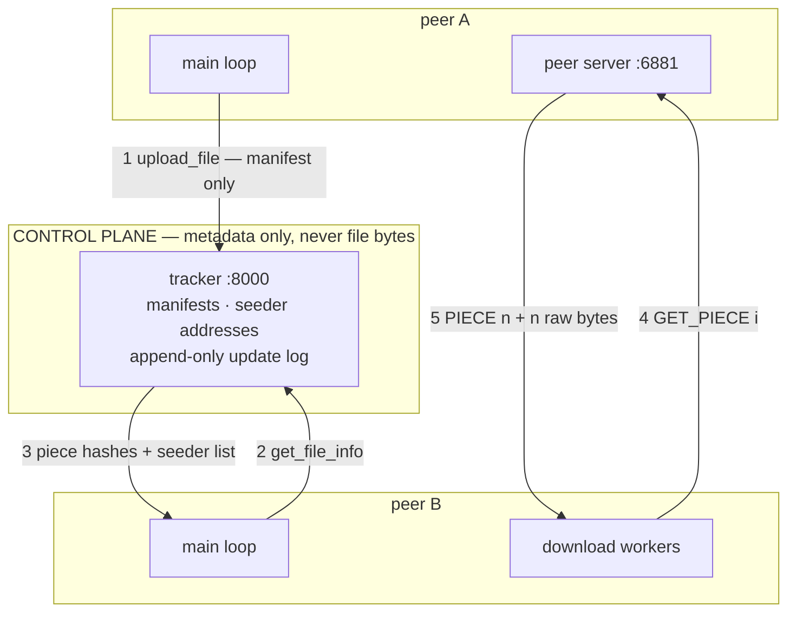

# chord-dht-filesystem | C++17

> Fault-tolerant peer-to-peer distributed file system — a Chord distributed hash table for the
> data plane, a replicated tracker for the control plane.

> [!NOTE]
> **Under active reconstruction: the legacy peer-to-peer layer works, the Chord layer is not
> built yet.** This repository began as an operating-systems course assignment and is being
> rebuilt into a distributed hash table. Every row in the table below was verified by a script
> at the commit it names — nothing is claimed to work that has not been run.
>
> An earlier version of this file claimed multi-tracker synchronisation. That feature was never
> implemented — `connect_to_peer()` was defined and never called. It was removed rather than
> left to be discovered.

---

## Status

Verified at commit `a9c69cc` on 9 Sep 2026, by running the scripts in the Evidence column on
the machine described in [`BENCHMARKS.md`](BENCHMARKS.md).

| Component | State | Evidence |
|---|---|---|
| Build | **Works.** Clean build of both binaries, zero warnings | `make clean && make` |
| Tracker — users, groups, metadata | **Works** in memory | `scripts/e2e-smoke.sh` |
| Tracker — persistence across restart | **Works.** Replay applies effects directly rather than re-running commands, so recovery cannot be refused by an authorisation guard it never reaches | `scripts/e2e-persistence.sh` — 4/4 |
| Tracker — multi-tracker sync | **Never existed.** Dead code; superseded by the planned Raft group | — |
| Peer-to-peer transfer | **Works**, verified by SHA-1 end to end across a piece-boundary sweep | `scripts/e2e-smoke.sh` PASS · `scripts/e2e-edge.sh` 6/7 |
| Chunking + SHA-1 manifests | **Works**, including the short final piece | `scripts/e2e-edge.sh` — the `minus1`, `exact_1piece` and `plus1` cases |
| Zero-byte file | **Broken.** An empty file produces an empty manifest, the tracker rejects the upload, and the client reports success anyway | `scripts/e2e-edge.sh` — case `empty`, a deliberately failing test |
| Tracker — survives an abrupt client disconnect | **Works.** `SIGPIPE` is ignored, so a peer that vanishes mid-reply is an error value rather than a fatal signal | `scripts/e2e-hangup.sh` |
| Chord ring, routing, replication, stabilisation | **Not built yet** | — |

Known open defects are listed under [Limitations](#limitations-and-future-work); full
reproduction steps for every one: [`docs/failures.md`](docs/failures.md) and
[`PROGRESS.md`](PROGRESS.md) § Audit.

---

## Overview

A peer-to-peer file-sharing system in which files never live on a central server. Each
participant stores files on its own disk and serves them directly to others. A tracker process
holds only metadata — which files exist, how they are split into 512 KB pieces, the SHA-1
fingerprint of each piece, and which peers hold them. To fetch a file, a peer asks the tracker
who has it, connects to those peers directly, and pulls different pieces from several of them
concurrently, verifying each piece against its fingerprint before writing.

The work in progress replaces the tracker's role as the single index with a **Chord distributed
hash table**: a ring of nodes that between them own the whole key space, so finding which node
holds a chunk becomes a routing problem solved in O(log N) hops rather than a lookup in one
process's memory — with no node knowing the whole map, and no single node's failure losing it.

- **What it does:** distributes file chunks across a ring of peers, routes lookups in O(log N)
  hops, replicates each chunk to three successors, repairs routing state after failures, and
  transfers chunks in parallel with per-chunk integrity verification.
- **What makes it non-trivial:** the routing state has to stay correct while nodes join and die
  underneath it. Chord's guarantee is that lookups remain *correct* as long as successor
  pointers are correct, even when every finger table is stale — separating correctness from
  performance is the whole design.
- **What it deliberately does not do:** no storage engine (chunks are files on disk), no NAT
  traversal, no wire encryption or authentication, no incentive mechanism. Reasoning for each:
  [`ARCHITECTURE.md`](ARCHITECTURE.md) § Scope boundary.

---

## Results

**Single-peer transfer baseline**, measured 9 Sep 2026 at commit `e381179`, 512 KB pieces, one
seeder, all processes on one host. Median of three runs, each with fresh processes:

| Transfer | Median | Throughput |
|---|---|---|
| 1 MB | 0.048 s | 20.9 MB/s |
| 10 MB | 0.216 s | 46.2 MB/s |
| 100 MB | 1.404 s | **71.2 MB/s** |

Throughput more than triples from 1 MB to 100 MB because the per-transfer fixed cost — a tracker
round trip, a connection to the seeder, a manifest parse — is amortised over more bytes, not
because the transfer speeds up. With one seeder the worker pool runs a single thread, so this is
a **sequential** baseline; it exists to be the "before" for the parallel chunked transfer in
Phase 5, and it cannot be recovered once that code lands.

Method, the wide run-to-run spread, and the reasons this number flatters the system (loopback,
warm page cache, shared cores) are in [`BENCHMARKS.md`](BENCHMARKS.md) §1 — including the first
version of the harness, which reported 165 MB/s because it timed `ftruncate` rather than the
transfer.

Planned curves, and the design question each settles, are listed in
[`BENCHMARKS.md`](BENCHMARKS.md) § Curves worth having. Method, commit fingerprints and the
measurement environment — including a frank list of the distortions that come from running every
peer on one laptop — are recorded there **before** any number is taken.

---

## Architecture — as it exists today



**Request path:** ① the uploading peer hashes its file in 512 KB pieces and sends the manifest —
never the bytes — to the tracker. ② the downloading peer asks for that manifest and ③ receives
the piece hashes plus a list of seeders as `ip:port`. ④ its workers connect **directly** to those
peers and request pieces by index. ⑤ each reply is a length-prefixed header then raw bytes; the
SHA-1 is verified before the piece is written at its offset, and a mismatch re-requests from a
different seeder.

The target Chord architecture is drawn once its open design questions are resolved — see
[`ARCHITECTURE.md`](ARCHITECTURE.md) § Open forks. Drawing it earlier would decide those
questions by implication.

Diagram-as-text on purpose: it renders on the repository host, it diffs in review, and it cannot
silently drift out of date the way an exported image does.

---

## Key Design Rationales

The section that turns a repository into an argument. Written from the decision log in
[`ARCHITECTURE.md`](ARCHITECTURE.md).

### 512 KB chunks — pinned for the comparison, swept for the justification

The build uses 512 KB chunks because the Phase 0 baseline was measured at 512 KB, and the
headline transfer claim is parallel transfer *against that baseline*. Changing chunk size at the
same time as adding parallelism would move two variables and make the improvement
unattributable. Chunk size is therefore held constant for the before/after and swept separately,
with parallelism fixed, across `{64 KB, 256 KB, 512 KB, 2 MB, 8 MB}` — five points rather than
three, because three cannot distinguish a curve with a knee from a straight line.

**Rejected:** 64 KB. Chunk count here is a *routing* cost, not only an I/O cost — lookups are
iterative, so each costs two traversals per hop, and a 100 MB file at 64 KB is 1,600 chunks and
roughly 14,400 round trips of pure lookup before any payload moves. **Rejected:** 4 MB. It would
make the deduplication claim theoretical, since a 4 MB span rarely repeats across files.

**Stated in advance:** on loopback this curve may come out nearly flat, because there is no
network latency for larger chunks to amortise. If it is flat, that is the published result.

### `W = 2` — an acknowledged write is a true statement

Every chunk exists on three nodes: its owner and the owner's first two successors, which the
successor list already names. A write is acknowledged once the owner **and at least one
successor** hold it; the third copy propagates in the background. Reads consult one replica and
fall through to the next on a failed hash check.

The owner writes locally and sends to both successors in parallel, so `W = 2` waits for the
*faster* of the two while `W = 3` waits for both — one slow peer would otherwise set the latency
of every write.

**Rejected:** `W = 1` with background propagation. Faster and always available, but an
acknowledged write can be lost if the owner dies before propagating — a system that lies about
durability. **Rejected:** `W = 3`. It buys protection against a second simultaneous failure by
making writes fail during every first one.

**`W` is a runtime parameter, not a constant.** Sweeping it from 1 to 3 produces write latency
and write-success-under-kill as a measured curve, which is what turns "where does this sit on the
consistency/availability trade-off, and how would you flip it?" from an opinion into a plot.

**Cost:** between acknowledgement and background propagation the advertised replication factor of
three is briefly untrue, so that window is measured rather than assumed. If both successors are
unreachable the write fails loudly, which is the correct behaviour given the alternative.

### Chunks are content-addressed, which deletes the conflict problem

A chunk's key in the ring is `SHA-1` of its own contents. Two replicas therefore cannot disagree:
the value at a key is by definition the bytes that hash to it. There is no newer version, so the
data plane carries **no versioning, no vector clocks and no conflict resolution** — not because
they were solved, but because the key was chosen so they cannot arise. Reads are self-verifying,
since the client hashes what arrived and compares it to the key it requested, and identical
chunks across different files deduplicate for free.

This is why the quorum rule `W + R > RF` does not appear in this system. That rule guarantees a
read set overlaps a write set *so a read sees the latest version*; with immutable values there is
no latest version, so `W` and `R` decouple — `W` buys durability, `R` buys availability, and they
are set independently.

**Rejected:** keying chunks by `(file_id, chunk_index)`, which is closer to the original
protocol. It makes the value at a key mutable, which brings back conflicting replicas,
versioning, clock skew and read repair — choosing to have a consistency problem.

**Cost:** no in-place update (a changed file produces new keys, and the superseded chunks are
garbage; there is no collector, which is a stated scope boundary), and no influence over
placement at all.

The consistency/availability discussion is not lost — it **moves to the metadata**, which is
genuinely mutable and is the plane replicated by consensus. The system sits in two places on
purpose: available and conflict-free on the data path, consistent on the control path.

### A refused connection is proof; a timeout is only a suspicion

Failure detection reuses traffic the system already sends. Stabilisation's periodic call to the
successor is the floor, and on top of it **every** other code path that talks to the successor —
lookups, `notify`, chunk transfers — reports its failures to the same detector instead of
discarding them. Detection time is therefore `min(next stabilise, next natural traffic)`:
near-instant on a busy ring, degrading to plain stabilisation on an idle one, where nobody is
affected by the delay.

The two failure signals are not merged. `ECONNREFUSED` means the far kernel sent a reset and
nothing is listening — proof, so the node is evicted at once. A **timeout** is ambiguous between
dead, slow, and packet loss, so it marks the successor suspect and needs a second failure or
confirmation from the next stabilisation round.

**Rejected:** active heartbeats. They buy a bounded detection time, and charge permanent
background traffic, two more tuning constants, and designed-in false positives — a slow node
evicted while still serving. They would also have misfired *here specifically*: every peer in a
test ring shares the same 8 cores, so aggressive heartbeats would manufacture node deaths that
are an artefact of the test rig rather than a property of the system.

**Also rejected:** a phi-accrual detector (Cassandra's adaptive suspicion level). It is the better
answer on a real network and the wrong one on loopback, which has no jitter for it to adapt to.

**Cost:** detection time is a distribution rather than a constant, so reconvergence is published
as two numbers — under load and idle — instead of one.

### Lookups are iterative, and that is a measurement decision

A lookup is driven by the originator: each node answers "I am the owner" or "here is someone
closer" and returns immediately, and the client opens the next connection itself. The Chord
paper's pseudocode is recursive — a node forwards on your behalf and the answer returns down the
chain.

The reason is that the routing layer's headline number is **hop count against ring size**. Under
iterative routing the client counts its own loop iterations, so the instrument sits outside the
system being measured. Under recursive routing the ring reports its own hop count and the plot
shows what the system says about itself. The same property gives exact failure attribution — a
node times out and the client knows which one — which is what the failure-recovery phase is
built on.

**Rejected:** recursive. Lower latency and NAT-friendly, but it costs nested timeouts across the
path, removes failure attribution, makes hop counts self-reported, and — in a thread-per-
connection TCP codebase — holds a blocked thread on every node in the path for the duration of
every lookup.

**Cost:** two network traversals per hop instead of one, so roughly double the lookup latency.
Nearly free on loopback, which is where these benchmarks run and which is declared as a
distortion at the top of [`BENCHMARKS.md`](BENCHMARKS.md). The fix for a real deployment is a
short-TTL lookup cache at the originator, not a different routing model: a stale hint costs one
wasted hop and self-corrects, because a routing hint is validated before use and can only ever
cost hops, never correctness.

### Two framing schemes, not one

Client↔tracker messages are newline-delimited; client↔client piece transfers are
length-prefixed. TCP is a byte stream and gives no message boundaries, so framing is the
application's job — but a delimiter is impossible for file data, which contains the delimiter
byte by chance.

**Rejected:** a single scheme for both. Newline-delimiting everything corrupts binary payloads;
length-prefixing everything makes the human-readable control protocol harder to debug by hand,
which matters a lot while the system is being built.

### One conversation per thread, and every request is read to completion

The client used to send `update_seeder` and never read the reply. The tracker answered anyway,
that reply stayed in the socket buffer, and **every later response was one behind — for the
life of the connection.** It surfaced as downloads that sized the destination from one file and
verified the bytes against a different file's hashes.

The rule now has no exceptions: every request is followed by exactly one response, read before
the next request is sent. Where a background thread needs to talk to the tracker, it opens
**its own connection** rather than sharing the main loop's.

That second half is the part worth arguing about. The obvious fix is a mutex on the socket —
and it does not work, because **a mutex protects state and this is a rule about sequence.** Two
threads cannot share one request/response conversation no matter how it is locked, since one
can consume the other's reply. The fix is to remove the sharing, not to guard it.

Cost: one extra connection per client, and one round trip per completed download — per file,
not per piece.

### One command, one reply, one line — enforced by the framing layer

The control protocol is newline-delimited, so a reply that contains a newline of its own is
delivered as two replies and every later reply on that connection is one behind. Five reply
strings did exactly that. The rule is now owned by `send_all`, the single function that frames a
reply: it strips interior delimiters, logs when it has to, and appends exactly one terminator.

**Rejected:** fixing the five strings and moving on. It removes today's instances and adds no
rule, so the next such string reintroduces the defect — and the failure is silent, on a
connection that stays open and keeps answering wrongly. **Also rejected, for now:**
length-prefixed replies, which make the delimiter irrelevant rather than forbidden. That is the
better protocol, it is what the piece transfer already uses, and it is scheduled for Phase 5
when the transfer layer is rewritten; it buys nothing until a reply needs structured output.

Regression test: `scripts/e2e-framing.sh`, which drives a raw socket rather than the client —
the client reads one line per reply and would hide which side emitted the extra one.

### The tracker never sees file bytes

It holds manifests and peer addresses only. This keeps its state small enough to replicate
cheaply and makes the data path genuinely peer-to-peer rather than a relay.

**Rejected:** a tracker that also caches popular chunks. It would improve cold-start latency and
would reintroduce the central bandwidth bottleneck that peer-to-peer exists to remove.

### The original git history is preserved, not squashed

Ten commits predate the portfolio work; `pre-resurrection` tags the last coursework-era state.
The diff between what this was and what it becomes is the evidence that it was built over
months.

**Rejected:** a clean repository. Tidier, and it would have discarded the only record of how the
system actually developed — including a commit that regressed three handlers, which is a lesson
worth keeping visible.

*More rationales are added as the open forks resolve. Each names the alternative it rejected —
an entry without one is not finished.*

---

## Project structure

```
chord-dht-filesystem/
├── tracker.cpp            # Metadata index and peer discovery; thread per client
├── client.cpp             # Peer: main loop, peer server, download workers, heartbeat
├── sha1.h                 # Header-only wrapper over OpenSSL SHA1(), hex-encoded
├── Makefile               # Hand-written; builds both binaries with no warnings
├── scripts/
│   ├── e2e-smoke.sh       # Happy path: one file transferred, SHA-1 compared end to end
│   ├── e2e-edge.sh        # Piece-boundary sweep: 0, 1, n-1, n, n+1, 2n, multi-piece
│   ├── e2e-persistence.sh # Builds state, restarts the tracker, asks for the same facts back
│   ├── e2e-framing.sh     # One command, one reply, one line -- on a raw socket
│   ├── e2e-hangup.sh      # A client that vanishes must not take the tracker with it
│   └── make-testdata.sh   # Deterministic test corpus; regenerates testdata/ in <1 s
├── docs/
│   └── failures.md        # Every defect: how it was found, root cause, why the fix works
├── ARCHITECTURE.md        # Design + decision log: every fork, every rejected alternative
├── BENCHMARKS.md          # Every number, its method, its commit fingerprint
├── PROGRESS.md            # State, defect audit, error log, week tracker
├── SCALE_NOTES.md         # "What breaks at 10x", captured while building
├── GLOSSARY.md            # Every term: plain language first, then technical
└── testdata/              # Gitignored; regenerate with scripts/make-testdata.sh
```

---

## Quick start

> This section becomes a single `docker compose up` bringing up a five-peer ring and the
> tracker once the deployment kit lands in Phase 5. Until then, the build and the end-to-end
> suites run directly:

```bash
make clean && make          # both binaries, no warnings

./scripts/e2e-smoke.sh      # transfers a 300 KB file, compares SHA-1 end to end
./scripts/e2e-persistence.sh # restarts the tracker, checks the state came back
./scripts/e2e-framing.sh    # framing: malformed input must not desync the connection
./scripts/e2e-hangup.sh     # liveness: an abrupt client disconnect must not kill the tracker
./scripts/e2e-edge.sh       # piece-boundary sweep; 6/7 by design while R4 is open
```

Each suite reaps only its own processes, matched by port, so they can be run concurrently.
That was not true until 9 Sep: the reaper matched the binary path alone and two suites run
together killed each other's tracker, producing a failure that looked exactly like a product
regression. See error-log entry E6 in [`PROGRESS.md`](PROGRESS.md).

**Requirements:** g++ with C++17, OpenSSL development headers (`libssl-dev`), POSIX threads.
Developed on Ubuntu 24.04 / aarch64 under WSL2 with g++ 13.3.

---

## Testing

Five end-to-end suites, no unit tests, and no continuous integration yet — CI lands in Phase 5.

`e2e-edge.sh` **fails on purpose**: its `empty` case is defect R4, still open. A failing test
that pins a known defect is more useful than a passing test that avoids it, and it turns a
remembered bug into a regression check. Deleting the case would raise the pass rate and lower
the information.

---

## Limitations and future work

Stated limits read as engineering judgement. Unstated ones read as things that were missed.

- **The tracker is a single point of failure.** Replicating it with Raft is the planned Phase 2
  work; it is also the first thing cut if the schedule slips.
- **No wire encryption or peer authentication.** Any peer can join and any peer can be
  impersonated. Lifting this needs node identities bound to keys, not just addresses.
- **`GET_PIECE` serves any path a requester asks for** — a directory-traversal hole. Fixed when
  the transfer layer is rewritten; recorded rather than quietly patched, because it is a good
  example of trusting input from a peer you did not choose.
- **No timeouts on the peer path** (defect R8). Connection failures are handled; a peer that is
  alive but stalled is not, and will hang a download worker indefinitely. Four such peers hang
  a download permanently, silently, at zero progress.
- **A peer chooses how much memory this client allocates** (defect R7). The `PIECE <n>` header
  is used as an allocation size without being checked against the length the manifest implies.
- **Five tracker replies contain an embedded newline** (defect R6), so one command produces two
  lines and every later reply on that connection is one behind. The framing contract is not
  enforced anywhere; it is assumed by every caller.
- **No clean shutdown.** Every connection handler is a detached thread that nothing joins, so
  processes are killed rather than stopped — possibly mid-write.
- **All benchmarking is single-host.** Loopback has no propagation delay and all peers share one
  page cache and eight cores, so throughput numbers are optimistic and round-trip-sensitive
  numbers are very optimistic. Quantified in [`BENCHMARKS.md`](BENCHMARKS.md).

---

*This repository began as an operating-systems course assignment (Sep–Nov 2025). It is being
rebuilt as a distributed systems project; the original history is deliberately intact.*
