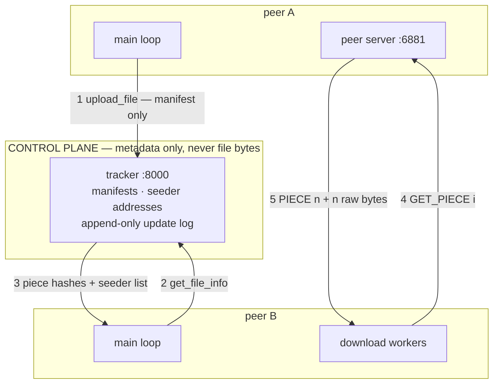

# chord-dht-filesystem | C++17

> Fault-tolerant peer-to-peer distributed file system — a Chord distributed hash table for the
> data plane, a replicated tracker for the control plane.

> [!WARNING]
> **Under active reconstruction — it does not currently build.** This repository began as an
> operating-systems course assignment and is being rebuilt into a distributed hash table. The
> honest status of every component is in the table below. Nothing here is claimed to work that
> has not been run.
>
> The previous version of this file claimed multi-tracker synchronisation. That feature was
> never implemented — `connect_to_peer()` was defined and never called. It has been removed
> rather than left to be discovered.

---

## Status

| Component | State |
|---|---|
| Build | **Broken.** `Makefile` references a `sha1.cpp` that does not exist, and omits `-lcrypto`. Being fixed now. |
| Tracker — users, groups, metadata | Works in memory |
| Tracker — persistence across restart | **Broken.** Command-log replay is rejected by the commands' own authorisation guards; all state is lost on restart |
| Tracker — multi-tracker sync | **Never existed.** Dead code; superseded by the planned Raft group |
| Peer-to-peer transfer | **Broken.** Fails end-to-end and leaves a full-size zero-filled file on disk |
| Chunking + SHA-1 manifests | Works |
| Chord ring, routing, replication, stabilisation | **Not built yet** |

Full reproduction steps for every defect: [`PROGRESS.md`](PROGRESS.md) § Audit.

---

## Overview

A peer-to-peer file-sharing system in which files never live on a central server. Each
participant stores files on its own disk and serves them directly to others. A tracker process
holds only metadata — which files exist, how they are split into 512 KB pieces, the SHA-1
fingerprint of each piece, and which peers hold them. To fetch a file, a peer asks the tracker
who has it, connects to those peers directly, and pulls different pieces from several of them
concurrently, verifying each piece against its fingerprint before writing.

The work in progress replaces the tracker's role as the single index with a **Chord distributed
hash table**: a ring of nodes that between them own the whole key space, so finding which node
holds a chunk becomes a routing problem solved in O(log N) hops rather than a lookup in one
process's memory — with no node knowing the whole map, and no single node's failure losing it.

- **What it does:** distributes file chunks across a ring of peers, routes lookups in O(log N)
  hops, replicates each chunk to three successors, repairs routing state after failures, and
  transfers chunks in parallel with per-chunk integrity verification.
- **What makes it non-trivial:** the routing state has to stay correct while nodes join and die
  underneath it. Chord's guarantee is that lookups remain *correct* as long as successor
  pointers are correct, even when every finger table is stale — separating correctness from
  performance is the whole design.
- **What it deliberately does not do:** no storage engine (chunks are files on disk), no NAT
  traversal, no wire encryption or authentication, no incentive mechanism. Reasoning for each:
  [`ARCHITECTURE.md`](ARCHITECTURE.md) § Scope boundary.

---

## Results

*No measured numbers yet.* The baseline is taken the moment the transfer path works, before any
optimisation — a "before" number cannot be recovered afterwards.

Planned curves, and the design question each settles, are listed in
[`BENCHMARKS.md`](BENCHMARKS.md) § Curves worth having. Method, commit fingerprints and the
measurement environment — including a frank list of the distortions that come from running every
peer on one laptop — are recorded there **before** any number is taken.

---

## Architecture — as it exists today



**Request path:** ① the uploading peer hashes its file in 512 KB pieces and sends the manifest —
never the bytes — to the tracker. ② the downloading peer asks for that manifest and ③ receives
the piece hashes plus a list of seeders as `ip:port`. ④ its workers connect **directly** to those
peers and request pieces by index. ⑤ each reply is a length-prefixed header then raw bytes; the
SHA-1 is verified before the piece is written at its offset, and a mismatch re-requests from a
different seeder.

The target Chord architecture is drawn once its open design questions are resolved — see
[`ARCHITECTURE.md`](ARCHITECTURE.md) § Open forks. Drawing it earlier would decide those
questions by implication.

Diagram-as-text on purpose: it renders on the repository host, it diffs in review, and it cannot
silently drift out of date the way an exported image does.

---

## Key Design Rationales

The section that turns a repository into an argument. Written from the decision log in
[`ARCHITECTURE.md`](ARCHITECTURE.md).

### Two framing schemes, not one

Client↔tracker messages are newline-delimited; client↔client piece transfers are
length-prefixed. TCP is a byte stream and gives no message boundaries, so framing is the
application's job — but a delimiter is impossible for file data, which contains the delimiter
byte by chance.

**Rejected:** a single scheme for both. Newline-delimiting everything corrupts binary payloads;
length-prefixing everything makes the human-readable control protocol harder to debug by hand,
which matters a lot while the system is being built.

### The tracker never sees file bytes

It holds manifests and peer addresses only. This keeps its state small enough to replicate
cheaply and makes the data path genuinely peer-to-peer rather than a relay.

**Rejected:** a tracker that also caches popular chunks. It would improve cold-start latency and
would reintroduce the central bandwidth bottleneck that peer-to-peer exists to remove.

### The original git history is preserved, not squashed

Ten commits predate the portfolio work; `pre-resurrection` tags the last coursework-era state.
The diff between what this was and what it becomes is the evidence that it was built over
months.

**Rejected:** a clean repository. Tidier, and it would have discarded the only record of how the
system actually developed — including a commit that regressed three handlers, which is a lesson
worth keeping visible.

*More rationales are added as the open forks resolve. Each names the alternative it rejected —
an entry without one is not finished.*

---

## Project structure

```
chord-dht-filesystem/
├── tracker.cpp            # Metadata index and peer discovery; thread per client
├── client.cpp             # Peer: main loop, peer server, download workers, heartbeat
├── sha1.h                 # Header-only wrapper over OpenSSL SHA1(), hex-encoded
├── Makefile               # BROKEN — see Status
├── scripts/
│   └── make-testdata.sh   # Deterministic test corpus; regenerates testdata/ in <1 s
├── ARCHITECTURE.md        # Design + decision log: every fork, every rejected alternative
├── BENCHMARKS.md          # Every number, its method, its commit fingerprint
├── PROGRESS.md            # State, defect audit, error log, week tracker
├── SCALE_NOTES.md         # "What breaks at 10x", captured while building
├── GLOSSARY.md            # Every term: plain language first, then technical
└── testdata/              # Gitignored; regenerate with scripts/make-testdata.sh
```

---

## Quick start

> Not yet honest to publish — the build is broken. This section becomes a single
> `docker compose up` bringing up a five-peer ring and the tracker. Until then:

```bash
# Regenerate the test corpus (deterministic, ~0.7 s, 121 MB)
./scripts/make-testdata.sh

# Build — CURRENTLY FAILS, see Status
make
```

**Requirements:** g++ with C++17, OpenSSL development headers (`libssl-dev`), POSIX threads.
Developed on Ubuntu 24.04 / aarch64 under WSL2 with g++ 13.3.

---

## Testing

No automated tests yet. The first lands with the build fix; continuous integration follows in
Phase 5. Recording that plainly rather than omitting the section — "how do you know a change
didn't break it?" currently has no good answer, and that is tracked as a known gap.

---

## Limitations and future work

Stated limits read as engineering judgement. Unstated ones read as things that were missed.

- **The tracker is a single point of failure.** Replicating it with Raft is the planned Phase 2
  work; it is also the first thing cut if the schedule slips.
- **No wire encryption or peer authentication.** Any peer can join and any peer can be
  impersonated. Lifting this needs node identities bound to keys, not just addresses.
- **`GET_PIECE` serves any path a requester asks for** — a directory-traversal hole. Fixed when
  the transfer layer is rewritten; recorded rather than quietly patched, because it is a good
  example of trusting input from a peer you did not choose.
- **No timeouts on the peer path.** Connection failures are handled; a peer that is alive but
  stalled is not, and will hang a download worker indefinitely.
- **No clean shutdown.** Every connection handler is a detached thread that nothing joins, so
  processes are killed rather than stopped — possibly mid-write.
- **All benchmarking is single-host.** Loopback has no propagation delay and all peers share one
  page cache and eight cores, so throughput numbers are optimistic and round-trip-sensitive
  numbers are very optimistic. Quantified in [`BENCHMARKS.md`](BENCHMARKS.md).

---

*This repository began as an operating-systems course assignment (Sep–Nov 2025). It is being
rebuilt as a distributed systems project; the original history is deliberately intact.*
