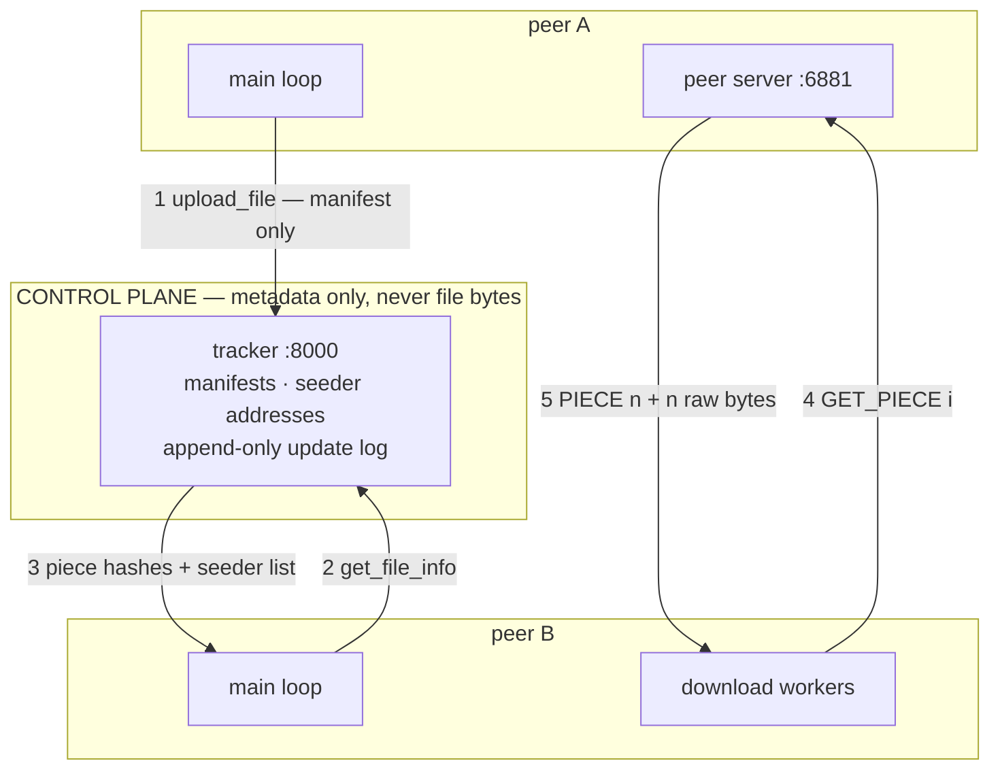

# chord-dht-filesystem | C++17

> Fault-tolerant peer-to-peer distributed file system — a Chord distributed hash table for the
> data plane, a replicated tracker for the control plane.

> [!NOTE]
> **Under active reconstruction: the legacy peer-to-peer layer works, the Chord layer is not
> built yet.** This repository began as an operating-systems course assignment and is being
> rebuilt into a distributed hash table. Every row in the table below was verified by a script
> at the commit it names — nothing is claimed to work that has not been run.
>
> An earlier version of this file claimed multi-tracker synchronisation. That feature was never
> implemented — `connect_to_peer()` was defined and never called. It was removed rather than
> left to be discovered.

---

## Status

Verified at commit `a9c69cc` on 9 Sep 2026, by running the scripts in the Evidence column on
the machine described in [`BENCHMARKS.md`](BENCHMARKS.md).

| Component | State | Evidence |
|---|---|---|
| Build | **Works.** Clean build of both binaries, zero warnings | `make clean && make` |
| Tracker — users, groups, metadata | **Works** in memory | `scripts/e2e-smoke.sh` |
| Tracker — persistence across restart | **Works.** Replay applies effects directly rather than re-running commands, so recovery cannot be refused by an authorisation guard it never reaches | `scripts/e2e-persistence.sh` — 4/4 |
| Tracker — multi-tracker sync | **Never existed.** Dead code; superseded by the planned Raft group | — |
| Peer-to-peer transfer | **Works**, verified by SHA-1 end to end across a piece-boundary sweep | `scripts/e2e-smoke.sh` PASS · `scripts/e2e-edge.sh` 6/7 |
| Chunking + SHA-1 manifests | **Works**, including the short final piece | `scripts/e2e-edge.sh` — the `minus1`, `exact_1piece` and `plus1` cases |
| Zero-byte file | **Broken.** An empty file produces an empty manifest, the tracker rejects the upload, and the client reports success anyway | `scripts/e2e-edge.sh` — case `empty`, a deliberately failing test |
| Chord ring, routing, replication, stabilisation | **Not built yet** | — |

Known open defects are listed under [Limitations](#limitations-and-future-work); full
reproduction steps for every one: [`docs/failures.md`](docs/failures.md) and
[`PROGRESS.md`](PROGRESS.md) § Audit.

---

## Overview

A peer-to-peer file-sharing system in which files never live on a central server. Each
participant stores files on its own disk and serves them directly to others. A tracker process
holds only metadata — which files exist, how they are split into 512 KB pieces, the SHA-1
fingerprint of each piece, and which peers hold them. To fetch a file, a peer asks the tracker
who has it, connects to those peers directly, and pulls different pieces from several of them
concurrently, verifying each piece against its fingerprint before writing.

The work in progress replaces the tracker's role as the single index with a **Chord distributed
hash table**: a ring of nodes that between them own the whole key space, so finding which node
holds a chunk becomes a routing problem solved in O(log N) hops rather than a lookup in one
process's memory — with no node knowing the whole map, and no single node's failure losing it.

- **What it does:** distributes file chunks across a ring of peers, routes lookups in O(log N)
  hops, replicates each chunk to three successors, repairs routing state after failures, and
  transfers chunks in parallel with per-chunk integrity verification.
- **What makes it non-trivial:** the routing state has to stay correct while nodes join and die
  underneath it. Chord's guarantee is that lookups remain *correct* as long as successor
  pointers are correct, even when every finger table is stale — separating correctness from
  performance is the whole design.
- **What it deliberately does not do:** no storage engine (chunks are files on disk), no NAT
  traversal, no wire encryption or authentication, no incentive mechanism. Reasoning for each:
  [`ARCHITECTURE.md`](ARCHITECTURE.md) § Scope boundary.

---

## Results

*No measured numbers yet.* The transfer path now works, so the baseline is the next measurement
taken — before any optimisation, because a "before" number cannot be recovered afterwards.

Planned curves, and the design question each settles, are listed in
[`BENCHMARKS.md`](BENCHMARKS.md) § Curves worth having. Method, commit fingerprints and the
measurement environment — including a frank list of the distortions that come from running every
peer on one laptop — are recorded there **before** any number is taken.

---

## Architecture — as it exists today



**Request path:** ① the uploading peer hashes its file in 512 KB pieces and sends the manifest —
never the bytes — to the tracker. ② the downloading peer asks for that manifest and ③ receives
the piece hashes plus a list of seeders as `ip:port`. ④ its workers connect **directly** to those
peers and request pieces by index. ⑤ each reply is a length-prefixed header then raw bytes; the
SHA-1 is verified before the piece is written at its offset, and a mismatch re-requests from a
different seeder.

The target Chord architecture is drawn once its open design questions are resolved — see
[`ARCHITECTURE.md`](ARCHITECTURE.md) § Open forks. Drawing it earlier would decide those
questions by implication.

Diagram-as-text on purpose: it renders on the repository host, it diffs in review, and it cannot
silently drift out of date the way an exported image does.

---

## Key Design Rationales

The section that turns a repository into an argument. Written from the decision log in
[`ARCHITECTURE.md`](ARCHITECTURE.md).

### Two framing schemes, not one

Client↔tracker messages are newline-delimited; client↔client piece transfers are
length-prefixed. TCP is a byte stream and gives no message boundaries, so framing is the
application's job — but a delimiter is impossible for file data, which contains the delimiter
byte by chance.

**Rejected:** a single scheme for both. Newline-delimiting everything corrupts binary payloads;
length-prefixing everything makes the human-readable control protocol harder to debug by hand,
which matters a lot while the system is being built.

### One conversation per thread, and every request is read to completion

The client used to send `update_seeder` and never read the reply. The tracker answered anyway,
that reply stayed in the socket buffer, and **every later response was one behind — for the
life of the connection.** It surfaced as downloads that sized the destination from one file and
verified the bytes against a different file's hashes.

The rule now has no exceptions: every request is followed by exactly one response, read before
the next request is sent. Where a background thread needs to talk to the tracker, it opens
**its own connection** rather than sharing the main loop's.

That second half is the part worth arguing about. The obvious fix is a mutex on the socket —
and it does not work, because **a mutex protects state and this is a rule about sequence.** Two
threads cannot share one request/response conversation no matter how it is locked, since one
can consume the other's reply. The fix is to remove the sharing, not to guard it.

Cost: one extra connection per client, and one round trip per completed download — per file,
not per piece.

### The tracker never sees file bytes

It holds manifests and peer addresses only. This keeps its state small enough to replicate
cheaply and makes the data path genuinely peer-to-peer rather than a relay.

**Rejected:** a tracker that also caches popular chunks. It would improve cold-start latency and
would reintroduce the central bandwidth bottleneck that peer-to-peer exists to remove.

### The original git history is preserved, not squashed

Ten commits predate the portfolio work; `pre-resurrection` tags the last coursework-era state.
The diff between what this was and what it becomes is the evidence that it was built over
months.

**Rejected:** a clean repository. Tidier, and it would have discarded the only record of how the
system actually developed — including a commit that regressed three handlers, which is a lesson
worth keeping visible.

*More rationales are added as the open forks resolve. Each names the alternative it rejected —
an entry without one is not finished.*

---

## Project structure

```
chord-dht-filesystem/
├── tracker.cpp            # Metadata index and peer discovery; thread per client
├── client.cpp             # Peer: main loop, peer server, download workers, heartbeat
├── sha1.h                 # Header-only wrapper over OpenSSL SHA1(), hex-encoded
├── Makefile               # Hand-written; builds both binaries with no warnings
├── scripts/
│   ├── e2e-smoke.sh       # Happy path: one file transferred, SHA-1 compared end to end
│   ├── e2e-edge.sh        # Piece-boundary sweep: 0, 1, n-1, n, n+1, 2n, multi-piece
│   ├── e2e-persistence.sh # Builds state, restarts the tracker, asks for the same facts back
│   └── make-testdata.sh   # Deterministic test corpus; regenerates testdata/ in <1 s
├── docs/
│   └── failures.md        # Every defect: how it was found, root cause, why the fix works
├── ARCHITECTURE.md        # Design + decision log: every fork, every rejected alternative
├── BENCHMARKS.md          # Every number, its method, its commit fingerprint
├── PROGRESS.md            # State, defect audit, error log, week tracker
├── SCALE_NOTES.md         # "What breaks at 10x", captured while building
├── GLOSSARY.md            # Every term: plain language first, then technical
└── testdata/              # Gitignored; regenerate with scripts/make-testdata.sh
```

---

## Quick start

> This section becomes a single `docker compose up` bringing up a five-peer ring and the
> tracker once the deployment kit lands in Phase 5. Until then, the build and the end-to-end
> suites run directly:

```bash
make clean && make          # both binaries, no warnings

./scripts/e2e-smoke.sh      # transfers a 300 KB file, compares SHA-1 end to end
./scripts/e2e-persistence.sh # restarts the tracker, checks the state came back
./scripts/e2e-edge.sh       # piece-boundary sweep; 6/7 by design while R4 is open
```

Run them one at a time. Each suite reaps stray processes by binary name, so two suites running
concurrently will kill each other's tracker and produce a failure that looks like a product bug.

**Requirements:** g++ with C++17, OpenSSL development headers (`libssl-dev`), POSIX threads.
Developed on Ubuntu 24.04 / aarch64 under WSL2 with g++ 13.3.

---

## Testing

Three end-to-end suites, no unit tests, and no continuous integration yet — CI lands in Phase 5.

`e2e-edge.sh` **fails on purpose**: its `empty` case is defect R4, still open. A failing test
that pins a known defect is more useful than a passing test that avoids it, and it turns a
remembered bug into a regression check. Deleting the case would raise the pass rate and lower
the information.

---

## Limitations and future work

Stated limits read as engineering judgement. Unstated ones read as things that were missed.

- **The tracker is a single point of failure.** Replicating it with Raft is the planned Phase 2
  work; it is also the first thing cut if the schedule slips.
- **No wire encryption or peer authentication.** Any peer can join and any peer can be
  impersonated. Lifting this needs node identities bound to keys, not just addresses.
- **`GET_PIECE` serves any path a requester asks for** — a directory-traversal hole. Fixed when
  the transfer layer is rewritten; recorded rather than quietly patched, because it is a good
  example of trusting input from a peer you did not choose.
- **No timeouts on the peer path** (defect R8). Connection failures are handled; a peer that is
  alive but stalled is not, and will hang a download worker indefinitely. Four such peers hang
  a download permanently, silently, at zero progress.
- **A peer chooses how much memory this client allocates** (defect R7). The `PIECE <n>` header
  is used as an allocation size without being checked against the length the manifest implies.
- **Five tracker replies contain an embedded newline** (defect R6), so one command produces two
  lines and every later reply on that connection is one behind. The framing contract is not
  enforced anywhere; it is assumed by every caller.
- **No clean shutdown.** Every connection handler is a detached thread that nothing joins, so
  processes are killed rather than stopped — possibly mid-write.
- **All benchmarking is single-host.** Loopback has no propagation delay and all peers share one
  page cache and eight cores, so throughput numbers are optimistic and round-trip-sensitive
  numbers are very optimistic. Quantified in [`BENCHMARKS.md`](BENCHMARKS.md).

---

*This repository began as an operating-systems course assignment (Sep–Nov 2025). It is being
rebuilt as a distributed systems project; the original history is deliberately intact.*
